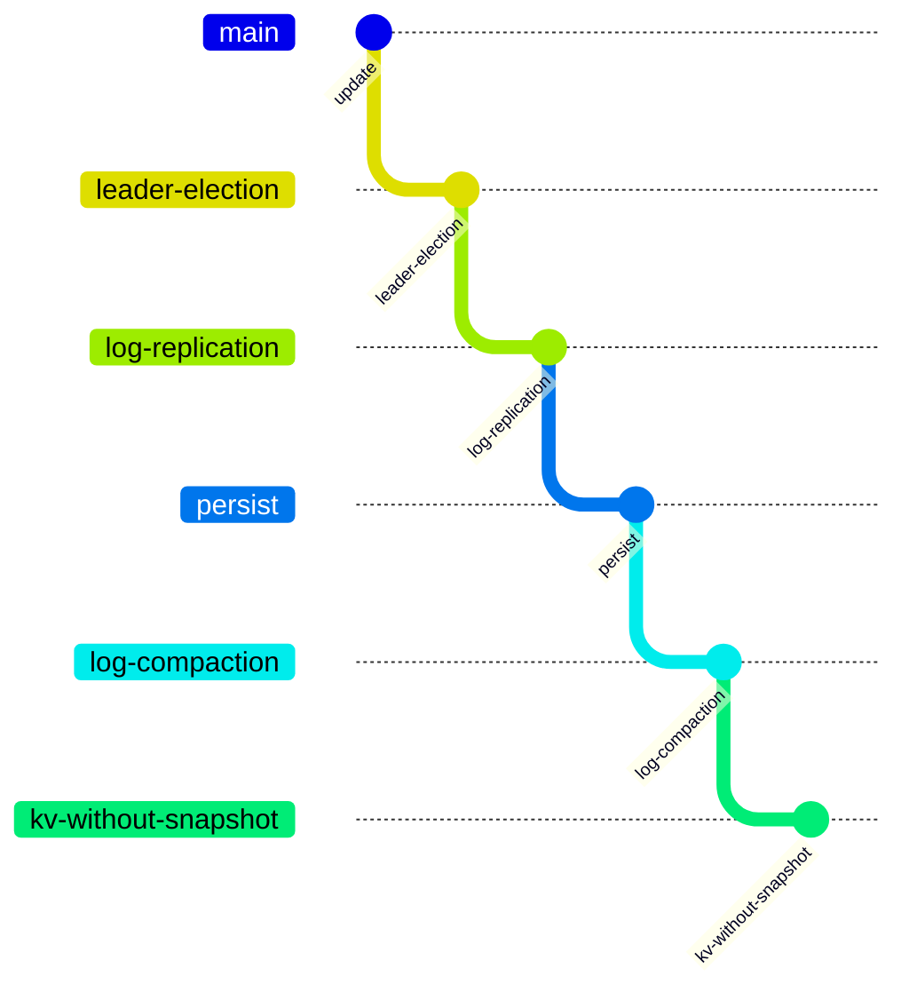

# 6.5840

I create this repository after finishing log-replication. 

The git branch information was provided below.

### Lab 1: MapReduce

Introduction: [Lecture](md/Lecture-1.md)

RPC and Threads: [Lecture](md/Lecture-2.md)

[Lab](md/Lab-1.md)

### Lab 2: Raft

GFS: [Lecture](md/Lecture-3.md)

Primary-Backup Replication: [Lecture](md/Lecture-4.md)

Raft: [Lecture](md/Lecture-5.md) 

[Lab](md/Lab-2.md) 

### Lab 3:KV Service

Linearizability: [Lecture](md/Lecture-9.md)

ZooKeeper: [Lecture](md/Lecture-10.md)

[Lab](md/Lab-3.md)
