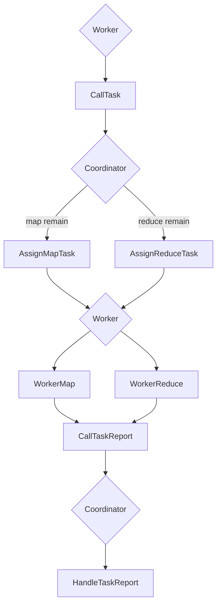

## Lab-1 MapReduce

- Target: Fill the blank in go program `worker.go`, `rpc.go`, `coordinator.go`
- First go through the hint, started at `worker.go`'s `Worker()` which is called in `main/mrworker.go`, ask the coordinator for a Task.
- The Coordinator allocate map or reduce task to the Worker, and then the Worker Handle it.



- Although the task are divided into map and reduce, I just call them Task and use the same struct to record them.

  ```go
  type TaskArgs struct {
  	TaskType     int
  	MapNumber    int
  	ReduceNumber int
  	FileName     string
  	NMap         int
  	NReduce      int
  }
  ```

  And set the state number as 

  ```go
  const (
  	_map    = 0
  	_reduce = 1
  	_wait   = 2
  	_end    = 3
  	_failed = 4
  )
  ```

- We also need to fill `struct Coordinator` to record the map and reduce informations then init it in `MakeCoordinator()`.

  ```go
  type Coordinator struct {
  	files          []string
  	NReduce        int
  	NMap           int
  	MapTaskLog     []int //0 unused, 1 assigned, 2 finished
  	ReduceTaskLog  []int
  	MapFinished    int
  	ReduceFinished int
  	lock           sync.Mutex
  }
  ```

  ```go
  func MakeCoordinator(files []string, nReduce int) *Coordinator {
  	c := Coordinator{}
  	c.files = files
  	c.NMap = len(files)
  	c.NReduce = nReduce
  	c.MapTaskLog = make([]int, c.NMap)
  	c.ReduceTaskLog = make([]int, c.NReduce)
  	c.MapFinished = 0
  	c.ReduceFinished = 0
  	c.server()
  	fmt.Println("Coordinator initialized")
  	return &c
  }
  ```

- Use `call()` function for a worker to contact with coordinator, code in `CallExample()` show us the usage.

  ```go
  func CallTask() *TaskArgs {
  	args := ExampleArgs{}
  	reply := TaskArgs{}
  	err := call("Coordinator.AllocateTask", &args, &reply)
  	if !err {
  		fmt.Println("call task failed")
  		reply.TaskType = _wait
  	}
  	return &reply
  }
  ```

  ```go
  func (c *Coordinator) AllocateTask(args *ExampleArgs, reply *TaskArgs) error {
  	c.lock.Lock()
  	if c.MapFinished < c.NMap {
  		//allocate map task
  		c.AssignMapTask(reply)
  		fmt.Println("[Cooridinator] AllocateMapTask")
  	} else if c.MapFinished == c.NMap && c.ReduceFinished < c.NReduce {
  		c.AssignReduceTask(reply)
  		fmt.Println("[Cooridinator] AllocateReduceTask")
  	} else {
  		reply.TaskType = _end
  		c.lock.Unlock()
  	}
  	return nil
  }
  ```

- FInd the number of map or reduce then modify the reply, remember that the task may be lost or break so we should change the state from assigned to unused after a period.

  ```go
  func (c *Coordinator) AssignMapTask(reply *TaskArgs) {
  	allocate := -1
  	for i := 0; i < c.NMap; i++ {
  		if c.MapTaskLog[i] == 0 {
  			allocate = i
  			break
  		}
  	}
  	if allocate == -1 {
  		reply.TaskType = _wait
  		c.lock.Unlock()
  	} else {
  		reply.NReduce = c.NReduce
  		reply.TaskType = _map
  		reply.FileName = c.files[allocate]
  		reply.MapNumber = allocate
  		c.MapTaskLog[allocate] = 1
  		c.lock.Unlock()
  		go func() {
  			time.Sleep(10 * time.Second)
  			c.lock.Lock()
  			if c.MapTaskLog[allocate] == 1 {
  				c.MapTaskLog[allocate] = 0
  			}
  			c.lock.Unlock()
  		}()
  	}
  }
  ```

- Go back to Worker, handle the map and reduce. Remember we should keep the write operation **atomically**, so use a temp file and rename it when the file's content is already finished.

  - Map: create a new empty []KeyValue slice to store the correspondence between filename and content. Call `mapf` then append the slice. Create a bucket to store the hash relationship. For each line of the bucket, output the key/value pairs with `encoding/json` package.

    ```go
    func WorkerMap(mapf func(string, string) []KeyValue, task *TaskArgs) bool {
    	intermediate := []KeyValue{}
    	file, err := os.Open(task.FileName)
    	if err != nil {
    		log.Fatalf("cannot open %v", task.FileName)
    	}
    	content, err := io.ReadAll(file)
    	if err != nil {
    		log.Fatalf("cannot read %v", task.FileName)
    		return true
    	}
    	file.Close()
    
    	//call mapf
    	kva := mapf(task.FileName, string(content))
    	intermediate = append(intermediate, kva...)
    
    	//hash into bucket
    	bucket := make([][]KeyValue, task.NReduce)
    	for i := range bucket {
    		bucket[i] = []KeyValue{}
    	}
    	for _, kv := range intermediate {
    		bucket[ihash(kv.Key)%task.NReduce] = append(bucket[ihash(kv.Key)%task.NReduce], kv)
    	}
    
    	//write into intermediate file
    	for i := range bucket {
    		oname := "mr-" + strconv.Itoa(task.MapNumber) + "-" + strconv.Itoa(i)
    		ofile, _ := os.CreateTemp("", oname)
    		enc := json.NewEncoder(ofile)
    		for _, kv := range bucket[i] {
    			err := enc.Encode(&kv)
    			if err != nil {
    				log.Fatalf("cannot write %v", oname)
    			}
    		}
    		os.Rename(ofile.Name(), oname)
    		ofile.Close()
    	}
    
    	fmt.Println("[Worker] MapTask Finished")
    	return false
    }
    ```

  - Reduce: go through NMap with the reducenumber, get the key/value pairs and record them. Use `Sort` function, merge them with the same key.

    ```go
    func WorkerReduce(reducef func(string, []string) string, task *TaskArgs) bool {
    	intermediate := []KeyValue{}
    	for i := 0; i < task.NMap; i++ {
    		iname := "mr-" + strconv.Itoa(i) + "-" + strconv.Itoa(task.ReduceNumber)
    		//open && read intermediate file
    		file, err := os.Open(iname)
    		if err != nil {
    			log.Fatalf("cannot open %v", iname)
    			return true
    		}
    
    		dec := json.NewDecoder(file)
    		for {
    			var kv KeyValue
    			if err := dec.Decode(&kv); err != nil {
    				break
    			}
    			intermediate = append(intermediate, kv)
    		}
    		file.Close()
    	}
    	//sort
    	sort.Sort(ByKey(intermediate))
    
    	//output
    	oname := "mr-out-" + strconv.Itoa(task.ReduceNumber)
    	ofile, err := os.CreateTemp("", oname)
    	if err != nil {
    		log.Fatalf("cannot open %v", oname)
    		return true
    	}
    	for i := 0; i < len(intermediate); {
    		j := i + 1
    		for j < len(intermediate) && intermediate[j].Key == intermediate[i].Key {
    			j++
    		}
    		values := []string{}
    		for k := i; k < j; k++ {
    			values = append(values, intermediate[k].Value)
    		}
    		output := reducef(intermediate[i].Key, values)
    		fmt.Fprintf(ofile, "%v %v\n", intermediate[i].Key, output)
    		i = j
    	}
    	os.Rename(ofile.Name(), oname)
    	ofile.Close()
    
    	fmt.Println("[Worker] ReduceTask Finished")
    	return false
    }
    ```

- Now the map and reduce work is finished, we should talk to coordinator.

  ```go
  func CallTaskReport(task *TaskArgs) {
  	reply := ExampleReply{}
  	err := call("Coordinator.HandleTaskReport", &task, &reply)
  	if !err {
  		fmt.Println("call task report failed")
  	}
  }
  ```

  ```go
  func (c *Coordinator) HandleTaskReport(task *TaskArgs, reply *ExampleReply) error {
  	c.lock.Lock()
  	if task.TaskType == _map {
  		c.MapTaskLog[task.MapNumber] = 2
  		c.MapFinished++
  	}
  	if task.TaskType == _reduce {
  		c.ReduceTaskLog[task.ReduceNumber] = 2
  		c.ReduceFinished++
  	}
  	c.lock.Unlock()
  	return nil
  }
  ```

- Function `done()`

  ```go
  func (c *Coordinator) Done() bool {
  	ret := c.ReduceFinished == c.NReduce
  
  	return ret
  }
  ```

  