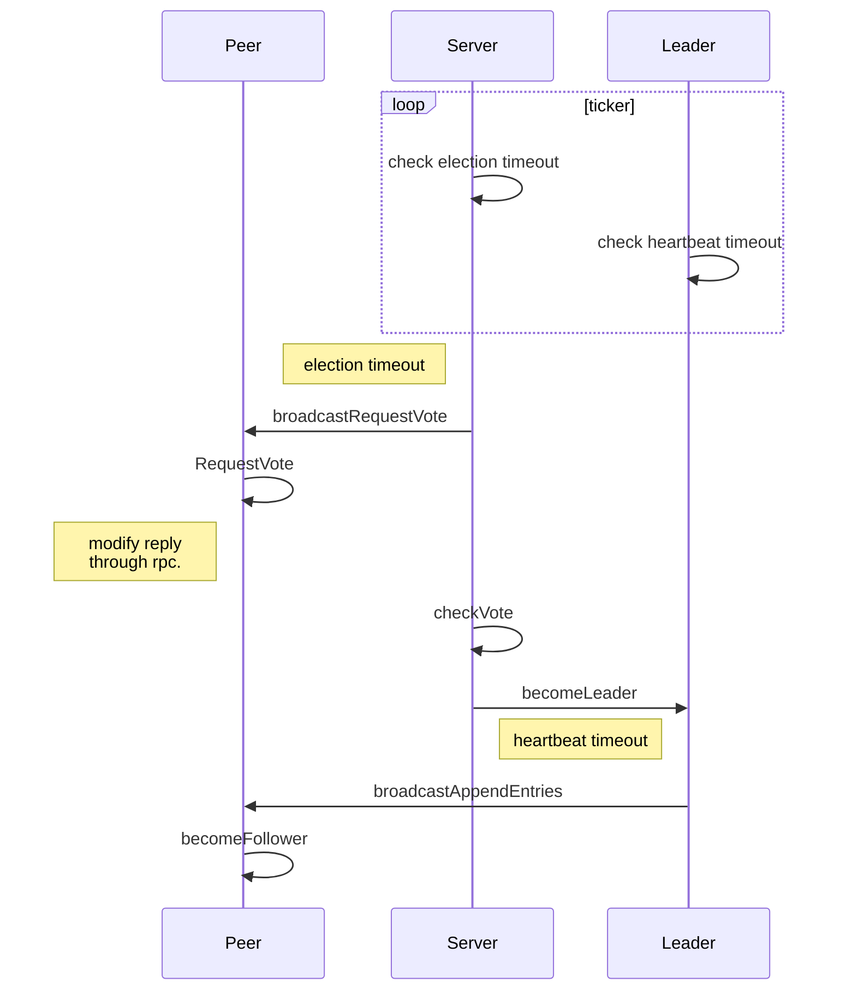

## Lab-2: Raft

### A: Leader election

In this lab, implement Raft leader election and heartbeats (AppendEntries RPCs with no log entries)

#### Basic

- [ ] Proper raft structure
- [ ] Randomized timer to elect leaders
- [ ] Init the raft server
- [ ] Start the election
- [ ] Spread vote message
- [ ] Handle eletion
- [ ] Start heartbeat
- [ ] Handle heartbeat

#### Hint

- The election timeout range from 150ms to 300 ms, heartbeat timeout sets to 50 ms. Improper time set may encouter some error.
- Be careful about dead lock and race condition.

#### Raft structure

Besides the structure provided, a raft server should record its own term, timeout,  log, peer status. Just like figure2. Additionally, we need a lock to protect the content and avoid race condition.

#### Start election

After we init the raft in `Make()`, the server should start timer to for election. There are two major way to handle a timer. One is to record the `time.Now()` to check timeout. Another way is to set a time.Timer which inform you as long as time has passed.

Only candidate or follower server should start an election when timeout.

Then request vote from its peers. We've used rpc in lab 1.

#### Spread vote message

Wrap all vote request arguments in one structure and send it through rpc.

- All the arguments in rpc should be capitalized.

And then peers server will receive the message and create a reply to candidate. Remember to check all messages send from other servers.

- Only when vote message's log and term is already up to date, follower can vote for it.

#### Handle election

When rpc successfully modify the reply. Our server can start handle the reply message. To compute that whether half of the node vote for itself. If true, become the leader and reset the track message of peers.

#### Start heartbeat

Every time we're ready to send an append entry, check whether the leader still connect to majority of the cluster.

Check the timeout like election timeout, then send a heartbeat message. Because append entry in follower lab handled differently from heartbeat, we should make sure which instruction to take.

Similar to election, using rpc to send message

#### Handle heartbeat

Change its status.

