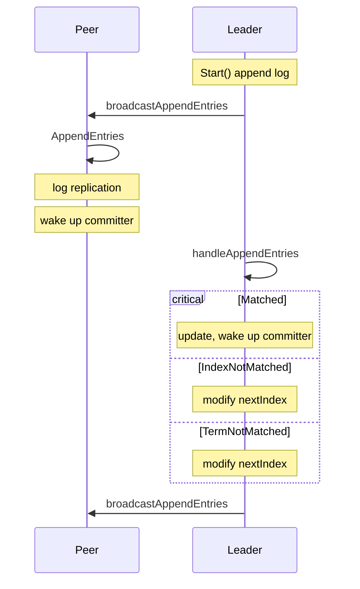
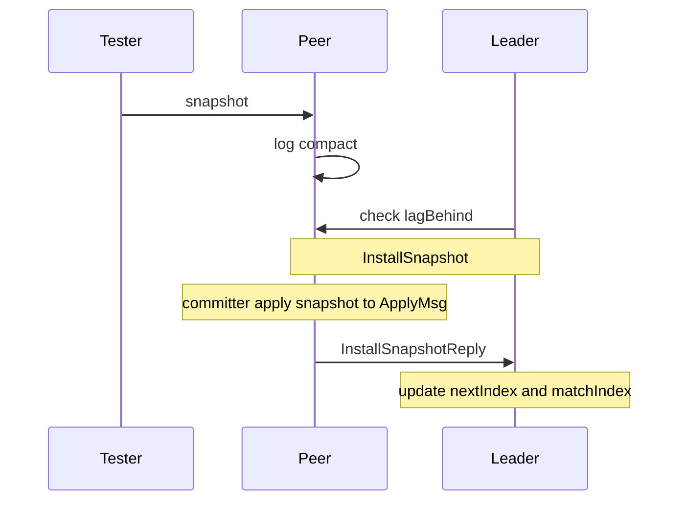

## Lab-2: Raft

### A: Leader election

In this lab, implement Raft leader election and heartbeats (AppendEntries RPCs with no log entries)

#### Basic

- [ ] Proper raft structure

- [ ] Randomized timer to elect leaders
- [ ] Init the raft server
- [ ] Start the election
- [ ] Spread vote message
- [ ] Handle eletion
- [ ] Start heartbeat
- [ ] Handle heartbeat

#### Hint

- The election timeout range from 150ms to 300 ms, heartbeat timeout sets to 50 ms. Improper time set may encouter some error.
- Be careful about dead lock and race condition.

#### Raft structure

Besides the structure provided, a raft server should record its own term, timeout,  log, peer status. Just like figure2. Additionally, we need a lock to protect the content and avoid race condition.

#### Start election

After we init the raft in `Make()`, the server should start timer to for election. There are two major way to handle a timer. One is to record the `time.Now()` to check timeout. Another way is to set a time.Timer which inform you as long as time has passed.

Only candidate or follower server should start an election when timeout.

Then request vote from its peers. We've used rpc in lab 1.

#### Spread vote message

Wrap all vote request arguments in one structure and send it through rpc.

- All the arguments in rpc should be capitalized.

And then peers server will receive the message and create a reply to candidate. Remember to check all messages send from other servers.

- Only when vote message's log and term is already up to date, follower can vote for it.

#### Handle election

When rpc successfully modify the reply. Our server can start handle the reply message. To compute that whether half of the node vote for itself. If true, become the leader and reset the track message of peers.

#### Start heartbeat

Every time we're ready to send an append entry, check whether the leader still connect to majority of the cluster.

Check the timeout like election timeout, then send a heartbeat message. Because append entry in follower lab handled differently from heartbeat, we should make sure which instruction to take.

Similar to election, using rpc to send message

#### Handle heartbeat

Change its status.

### B: log replication

Once a leader has been elected, it begins servicing client requests. Each client request contains a command to be executed by the replicated state machines through `Start()`. The leader appends the command to its log as a new entry, hen issues RPCs in **parallel** to each of the other servers to replicate the entry. When the entry is *safely* replicated, the leader applied the entry to its state machine and returns the result of that execution to the client.

#### Basic

- [ ] Proper log structure
- [ ] Transform command into leader's log entry.
- [ ] A tracker to track peer's `nextIndex` and `matchIndex`
- [ ] Send AppendEntires
- [ ] Handle AppendEntires (replicate log entry)
- [ ] Handle AppendEntriesReply (commit log entry)
- [ ] A committer to apply log entry

#### Structure

Besides the structure said in Leader election, we now need to do with log replication. So that we need something to record `nextIndex`, `matchIndex`, `LogEntires`, `applied` and `committed`. See Figure 2 for details.

There are so many servers in the cluster that difference always occurs. We need to keep it in sync by correcting error log entry. If a server encouter conflict with leader, it should reply the conflict term and wait for modifying. **Add `ConflictTerm and FirstConflictIndex` in `AppendEntriesReply`**.

Moreover, we need to apply command to `applych` when command is already replicate to most of the servers, then we should inform committer to commit the command. Besides continuely check newCommittedEntry, we can use `cond`, when a leader handling appendEntriesReply, check commit, and signal the cond.

#### Start()

Start agreement on the next command to be appended to Raft's log. First check the state of server. Then append the entry or do nothing.

#### Tracker

I use peerTracker to track `nextIndex` and `matchIndex` of peers. Additionally, it also record the time since last reply. We need to reset it when a leader was elected, and check the effectiveness of peer.

#### Send AppendEntries

prevLogIndex can be represented as `matchIndex - 1`, send necessary args through rpc.

#### AppendEntries

When server receive append entries, it should start to sync log. First check whether the prevlogindex and term is matched to leader. If everything goes well, append entries to server. Attention that there might be some difference, just truncate the difference and keep the same as leader. Don't forget to modify commitIndex to min(leaderCommit, index of last new entry).

What's more , when checking the prevlogindex, there are three conditions:

- Matched: index isn't out of range and prevLogTerm matched to leader's
- IndexNotMatched: Index is out of range.
- TermNotMatched: Index goes well, prevLogTerm doesn't match to leader's

Solution

- Matched: log replication
- IndexNotMatched: leader's prevLogIndex out of range. Reply with the lastLogIndex to leader.
- TermNotMatched: Disagreement occurs, find the firstConflictIndex to leader.

  This situation means the specific term has something wrong, we need to find the first index of the term. And the leader will resend AppendEntries with modified nextIndex.

#### Handle AppendEntriesReply

Besides what we do in leader election, we need to check the state of log.

- Matched: Modify the tracker of peers. Then go through peers to check whether of the leader's `commitIndex`.

- IndexNotMatched: This means that prevLogIndex out of range. Modify `matchIndex` to resend appendEntries message.

- TermNotMatched: There are two conditions:

  - Leader doesn't contain the conflict term's information: delete all the informations. (Modify nextIndex to FirstConflictIndex)
  - Leader's log contains the conflict term, modify nextIndex to leader's last Index of the term.
  - [txt](https://pdos.csail.mit.edu/6.824/notes/l-raft2.txt) Here gave the detailed description of how to roll back quickly.
  
  Then send appendEntries again to replicate log.

#### Committer

The committer should check if there are new committed entry to apply. Use `cond.Wait()` to avoid period check, and modify applied information.

#### Figure 8

 

(d) break the rule of **Leader Completeness** and **State Machine Safety**. 

To avoid this problem, raft never commits log entries from previous terms by counting replicas. This means (c) cannot commit index to 2, only when term 4 replicated to most of the server, the leader can change its commit index to 3. According to Log Matching, if term 4 is committed, that means term 2 is also committed.

- In addition, **commit index one by one seems not work well**. I've committed the index one by one. And there will be a disagreement occur. I've thought `currentTerm = log.term` is enough to handle the problem. But this may encouter a dead loop, cannot commit index because term 2 cannot replicate to S3. We can see that term continuely increase but didn't commit index till runtime error.

### C: Persistence

A real implementation would write Raft's persistent state to disk each time it changed, and would read the satte from disk when restarting after a reboot.

As we can see in figure 2, the persistent state on servers is currentTerm, votedFor and log entry.

So that our `persist()` and `readpersist()` functions are clear, encode or decode the three major element. (The original code provide a example for us, we can just replace "xxx" with the element above).

Another thing to think about is where to persist. Simply, everytime you modify the three elements, just run `persist()` after.

### D: log compaction

As we talk in [Lecture5](Lecture-5.md), the log cannot grow infinitely, we need snapshot to record the previous state and shorten the log.

The tester calls `Snapshot()` periodically, the snapshot will contian the complete table of key/value pairs. The server layer calls `Snapshot()` on every peer.

There is a [figure](https://pdos.csail.mit.edu/6.824/notes/raft_diagram.pdf) to better understand log compaction.

- [ ] Proper snapshot structure
- [ ] InstallSnapshot RPC structure
- [ ] `Snapshot()` implementation
- [ ] Send InstallSnapshot to peers
- [ ] Handle InstallSnapshotReply
- [ ] Send snapshot to the service in an `ApplyMsg`
- [ ] Persist the corresponding snapshot

#### Proper snapshot structure

As we can see in figure13, we need a `Index` to record the highest log entry that's reflected in the snapshot, `Term` represent the term of index stored in the log. Another thing is Data[].

As we known, the snapshot is stored in the log, we need addtional argument in Log structure to record snapshot. What's more, we need a bool to record whether the snapshot need to pend to applyCh

#### InstallSnapshot RPC structure

Just like AppendEntires and RequestVote, according to figure 13, `InstallSnapshotArgs` we need leader's `Term`, `From`(leader index), and `To`, most significantly, the `snapshot` to be sent.

Be careful that do not implement offset mechanism.

We need `InstallSnapshotReply` to know the work state of InstallSnapshot. An additional bool to record whether the snapshot Installed correctly.

#### `Snapshot()`

The tester periodically call Snapshot to server. We need to compress log according to the snapshot. Remember to judge whether the snapshot is stale. Then replace the overlapped part with snapshot.

When compacting snapshot, besides compress log, we also need to update `commitIndex` and `applied`

#### InstallSnapshot

InstallSnapshot RPC allows a Raft leader to tell a **lagging Raft peer** to replace its state with a snapshot. We can easily think of the leader broadcastAppendEntries which connects to peers. If the peer's snapshot is lag behind, send InstallSnapshot in **parallel** to tell them to update.

We talked about lag behind. We can put snapshot information in the first index of log entry, and then the log behind judgement can be `rf.peers[to].nextIndex <= rf.log.firstIndex()`

And when a server receive InstallSnapshot information. Check the message. If everything goes well, check the update message. If the server is already caughtup, return. Else, compact the log and return with need to pen.

#### HandleSnapshot

First check the message. And then update the matchIndex and nextIndex of peers. Now you can immediately send broadcastAppendEntries to update commit information of peers, or just wait the periodically check.

#### Send snapshot to ApplyMsg

We've said before, we have an argument represent the snapshot has updated. In **committer** where we commit command. Additionally add a check about snapshot pending, then **send it to applyCh**, **reset the state of the argument.**

#### Persist snapshot

If a server crashes, it must restart from persisted data. Raft should persist both Raft state and the corresponding snapshot. Don't forget to modify `persist.Save()`, the second argument is waiting for snapshot.

When a server restarts, the application layer reads the persisted snapshot and  restore its saved state. In the code they provided, in `Make()`, there is `readPersist()`, we need to decode persist state and **compact snapshot**. An error message will pops up when you forget to compact the snapshot when `readPersist()`.

