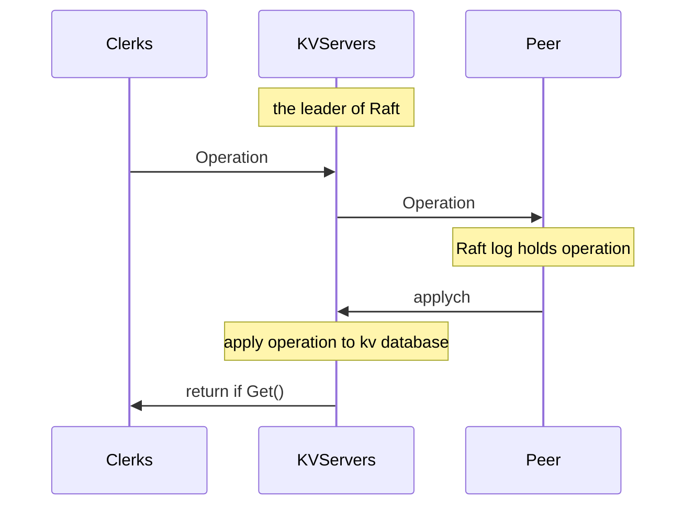

## Lab-3

[diagram](https://pdos.csail.mit.edu/6.824/notes/raft_diagram.pdf)

### A: key/value service

Now we need to build a FT key/value storage service using Raft. Implement `Put()`, `Get()`, `Append()`.

#### Basic

- [ ] Proper Operation, Clerk and KVServer structure
- [ ] Clerk send operations to KVServer
- [ ] KVServer apply the operation to Raft
- [ ] KVServer get the commit message from applych

#### Hint

- When many clients commit operation in parallel, the command from applych may probably differ what we just propose. We need to implement a notifier to record the state of command.
- Another thing to notice is duplicated operation. While `Get()` is idempotent, `Append()` and `Put()` may cause something unpredictable.

#### Structure

In order to detect duplication, we need to record every **Clerk num and Op num**. With the parameter, we can detect whether the operation is judged.

For Clerk, we need to send Operation to KVServer(the leader of Raft), an additional parameter to record the **ID of leader** can save the time to find leader.

In server, we should detect the re-send message, additionally add a map to record **the highest operation id from each clerk**.

As we mentioned before, KVServer need to wait until a operation is successfully logged in Raft and receive the message from applyCh. **Conditional variable** helps a lot. 

#### Clerk send operation

Use rpc to call functions in KVServer and get the reply through it.

Every operation need to send to the leader of Raft. Considering the failure of leader, in every operation we need to find the leader of servers. If the server is not leader, move ahead and re-send to another server till find the leader.

#### KVServer apply operation

Once a server receive operation from Clerk, firstly check whether the operation **is applied**, then check the state of itself (**leader**). If everything went well, start a notifier and wait until the notifier is signaled.

#### Notifier

Notifier need to record the **newest OpId**, modify it everytime a new operation passed from KVServer. Wait until the notifier is deleted from KVServer State Machine.

#### Receive from applyCh

The KVServer should receive the message from applyCh **continuely**. When a message arrives, start to apply it to client.

- If the operation is applied, drop it.
- Else, apply the operation to KVServer's database, modify the lastAppliedOpId information and notify it.
- When notifying,  check whether the OpId is the highest OpId the Notifier ever received, if is true, additionally delete the notifier from KVServer's State Machine. Then wake up the conditional variable.
- If the notifier is removed from the KVServer's State Machine, release KVServer from wait.
- Now we confirmed that the operation is successful replicated to the servers in Raft, if the operation is `Get`, reply the value

We need to notify the notifier a period after creating the it.

### B: Snapshots

A rebooting server has to replay the complete persisted Raft log in order to restore its state. Modify kvserver to cooperate with Raft to save log space, and reduce the restart time.

#### Basic

- [ ] Detect when to snapshot
- [ ] Create and read a snapshot
- [ ] Implement snapshot when start

#### Detect when to snapshot

The kvserver start with `maxraftstate`, check the definition of `ApplyMsg`, `SnapshotValid` parameter carries the information about snapshot. Every time we receive from applyCh, we should check the parameter:

-  If it is valid, read the snapshot and implement it.
- Else, apply the operation to kvserver's database and return to client. Then, compare `maxraftstate` with `kv.persister.RaftStateSize()` to detect whether to snapshot.

#### Make and read snapshot

As we can see in the [diagram](https://pdos.csail.mit.edu/6.824/notes/raft_diagram.pdf), kvserver can directly connect with Persistent Storage.

As we said in Raft lecture, we need to snapshot the key/value message and highest applied operation id.

- Read: read the snapshot from buffer and **decode** into database and max applied operation id.
- Write: **encode** the database and max applied operation id into Persistent Storage, also, we need to save a snapshot by calling Raft's `Snapshot()`.

#### Implement Snapshot when start

Following the instruction. If `maxraftstate != -1`, it means snapshot operation is valid and if the persister records snapshot information (`persister.SnapshotIsze() > 0`), read the snapshot as we said above.

Remember the snapshot contains database and max applied operation id informations, so we needn't to init it twice after snapshot.

