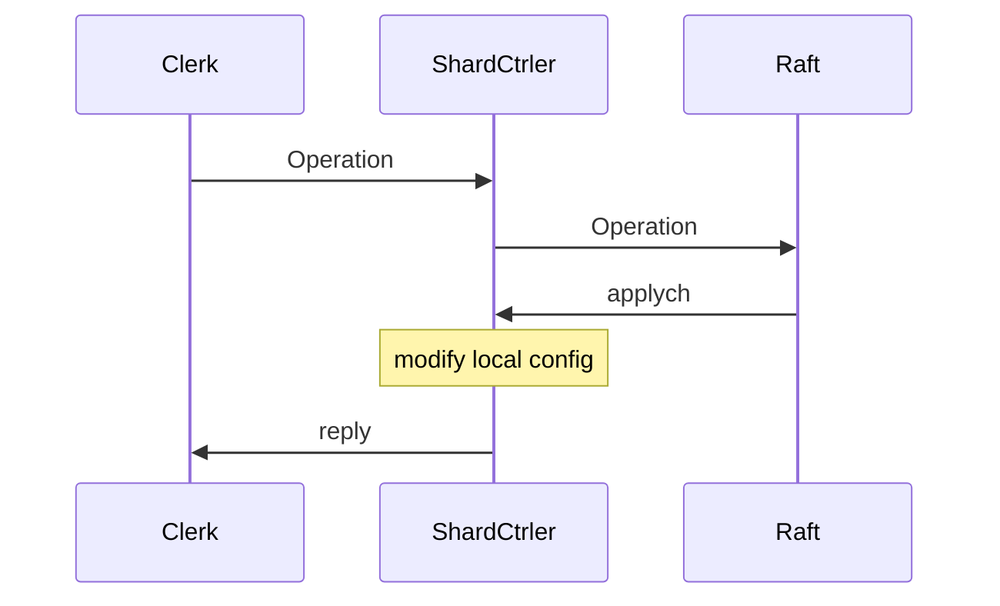

## Lab-4: Sharded Key/Value Service

### A: ShardsCtrler

#### Introduction

In this lab, we'll build a key/value storage system that "shards", or partitions, the key over a set of replica groups. A shard is a subset of the key/value pairs

The sharded key/value store will have two main components. First, **a set of replica groups**. Each replica group is responsible for a subset of shards. Second. the **"shard controller"**. It decides which replica group should serve each shard.

Clients consult the shard controller in order to find the replica group for a key and replica groups consult the controller in order to find out what shards to serve.



#### Basic

- [ ] Proper cmd args and reply structure
- [ ] Clients send operation to ShardCtrler
- [ ] ShardCtrler call Raft to log and reply to Clerk after modification
- [ ] **ShardCtrler modify local config information** (**rebalance**)

#### Structure

Basic parameter of operation:

```
	ClerkId int64
	OpId    int
	OpType  string
	Servers map[int][]string //Join
	GIDs    []int            //Leave
	Shard   int              //Move
	GID     int              //Move
	Num     int              //Query
	
```

In ShardCtrler, use a dead parameter similar to Raft to record the state of server. (I tried to use Raft's dead but it doesn't work). 

Also, `maxAppliedOpIdofClerk` map to record whether a operation is applied.

`IndexToCommand` map record the relationship between index to command, in order to signal server to reply to clerk. We will talk about it later.

#### Clients call operation

Just simply pass the correct parameter to ShardCtrler through rpc.

#### ShardCtrler call Raft

1. As we did in Lab 3A, when a shardCtrler receive a operation from clerk, first check whether itself is leader, if not, reply `WrongLeader`.

2. Correctly create a new operation with parameter from Clerk, check **applied state**, and send it to Raft by `Start(command interface{})`

   Moreover, in this step, we need to send reply to Clerk, this must be done after ShardCtrler modify the config information. This time I apply **channel** to wake up reply and satisfy the order.

3. The Raft will send back committed command through applych, so we need to generate a `applier` to continuely receive from applych. After received operations from applych, we need to apply the operation to shards and groups.

4. After modify the local config, remember to update the information of `maxAppliedOpIdofClerk`. And it is the time to reply to clerk, pass information to channel and wake up API before.

#### *ShardCtrler modify local config

First begin with the simplest and most unique `Query`. Just hands back the config information of specific num. No more operation to config.

1. Get last config
2. Select the operation type:
   - **Join**: 
     - add new map information to config's group. 
     - rebalance the Groups
     - *Hint: For the **first time**, we need to assign all the shards to the new group. If there are multiple groups at first join, assign all shards to the first group then rebalance it.
   - **Leave**:
     - delete the Group with specific gid
     - rebalance Groups
   - **Move**: 
     - Modify the Shard mapping with specific gid
3. Update the new config

##### *Core **rebalance**

`GidToShards` to record the mapping information between gid and shard.

1. Create a array with the element in `GidToShards` and sort it with the length of Shards.
2. Compute the average length of every group, allocate the expected length to each group.
3. Create `from` and `to` array stores the information of gaved out shards and the shards num needed by specific group.
4. Go through `GidToShards`, send the Shards to `from` if the shards num overflow, and record needed shard num in `to` if lack.
5. We must consider a gaved out shards cannot fill needed, so an additional **tmp** parameter to record how much it receive.
6. Balance `from` and `to`, modify the ShardsCtrle's shards information. (only to modify `to`, `from` remains the same).

- Hint:

  We need to make a division when compute the length of every group, if a serial leave comes and the nums of group declaimed to 0, the division will occur error. Modify the shards to gid(0) and return it before the computation.

  After rebalance, we need to **sort the shards** information in ShardsCtrler to keep config all the same. (Test: Check Same config on servers)

 

