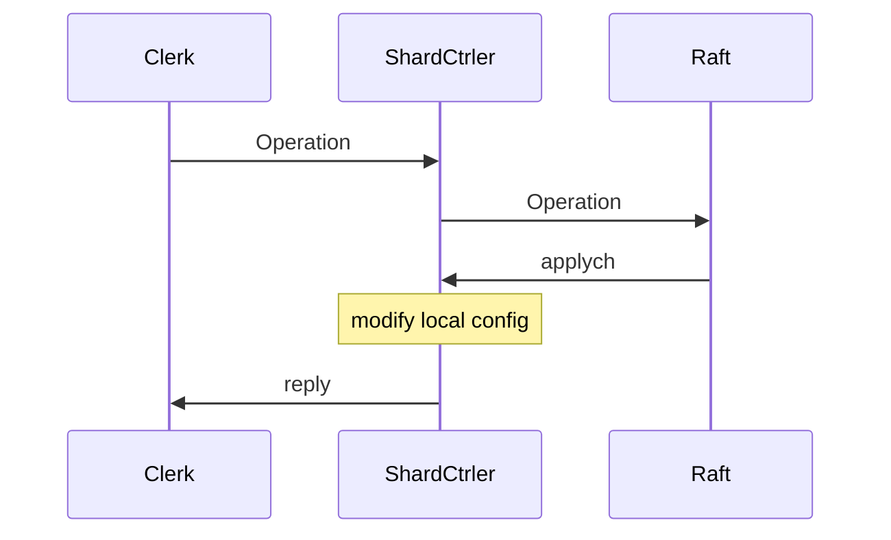
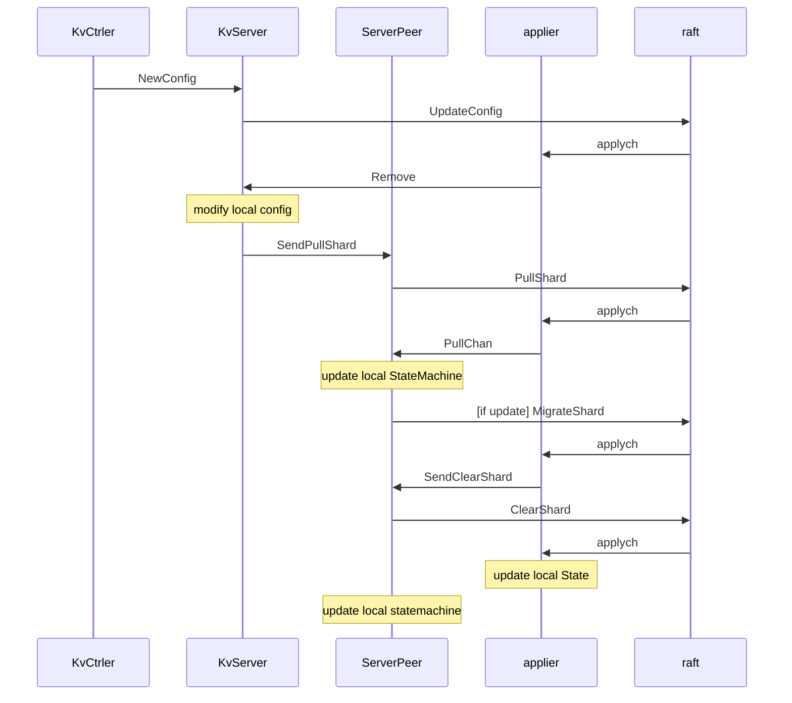

## Lab-4: Sharded Key/Value Service

### A: ShardsCtrler

#### Introduction

In this lab, we'll build a key/value storage system that "shards", or partitions, the key over a set of replica groups. A shard is a subset of the key/value pairs

The sharded key/value store will have two main components. First, **a set of replica groups**. Each replica group is responsible for a subset of shards. Second. the **"shard controller"**. It decides which replica group should serve each shard.

Clients consult the shard controller in order to find the replica group for a key and replica groups consult the controller in order to find out what shards to serve.



#### Basic

- [ ] Proper cmd args and reply structure
- [ ] Clients send operation to ShardCtrler
- [ ] ShardCtrler call Raft to log and reply to Clerk after modification
- [ ] **ShardCtrler modify local config information** (**rebalance**)

#### Structure

Basic parameter of operation:

```
	ClerkId int64
	OpId    int
	OpType  string
	Servers map[int][]string //Join
	GIDs    []int            //Leave
	Shard   int              //Move
	GID     int              //Move
	Num     int              //Query
	
```

In ShardCtrler, use a dead parameter similar to Raft to record the state of server. (I tried to use Raft's dead but it doesn't work). 

Also, `maxAppliedOpIdofClerk` map to record whether a operation is applied.

`IndexToCommand` map record the relationship between index to command, in order to signal server to reply to clerk. We will talk about it later.

#### Clients call operation

Just simply pass the correct parameter to ShardCtrler through rpc.

#### ShardCtrler call Raft

1. As we did in Lab 3A, when a shardCtrler receive a operation from clerk, first check whether itself is leader, if not, reply `WrongLeader`.

2. Correctly create a new operation with parameter from Clerk, check **applied state**, and send it to Raft by `Start(command interface{})`

   Moreover, in this step, we need to send reply to Clerk, this must be done after ShardCtrler modify the config information. This time I apply **channel** to wake up reply and satisfy the order.

3. The Raft will send back committed command through applych, so we need to generate a `applier` to continuely receive from applych. After received operations from applych, we need to apply the operation to shards and groups.

4. After modify the local config, remember to update the information of `maxAppliedOpIdofClerk`. And it is the time to reply to clerk, pass information to channel and wake up API before.

#### *ShardCtrler modify local config

First begin with the simplest and most unique `Query`. Just hands back the config information of specific num. No more operation to config.

1. Get last config
2. Select the operation type:
   - **Join**: 
     - add new map information to config's group. 
     - rebalance the Groups
     - *Hint: For the **first time**, we need to assign all the shards to the new group. If there are multiple groups at first join, assign all shards to the first group then rebalance it.
   - **Leave**:
     - delete the Group with specific gid
     - rebalance Groups
   - **Move**: 
     - Modify the Shard mapping with specific gid
3. Update the new config

##### *Core **rebalance**

`GidToShards` to record the mapping information between gid and shard.

1. Create a array with the element in `GidToShards` and sort it with the length of Shards.
2. Compute the average length of every group, allocate the expected length to each group.
3. Create `from` and `to` array stores the information of gaved out shards and the shards num needed by specific group.
4. Go through `GidToShards`, send the Shards to `from` if the shards num overflow, and record needed shard num in `to` if lack.
5. We must consider a gaved out shards cannot fill needed, so an additional **tmp** parameter to record how much it receive.
6. Balance `from` and `to`, modify the ShardsCtrle's shards information. (only to modify `to`, `from` remains the same).

- Hint:

  We need to make a division when compute the length of every group, if a serial leave comes and the nums of group declaimed to 0, the division will occur error. Modify the shards to gid(0) and return it before the computation.

  After rebalance, we need to **sort the shards** information in ShardsCtrler to keep config all the same. (Test: Check Same config on servers) 

### B: Sharded K/V Server

#### Introduction

Each shardkv server operates as part of a replcia group. Each replica group servers `Get`, `Put`, and `Append` operations for some of the key-space shards. Use `key2shard()` in `client.go` to find which shard a key belongs to. A single instance of the `shardctrler` service assigns shards to replica groups; when this assignment changes, replica groups have to hand off shards to each other, while ensuring that clients do not see inconsistent responses.

The storage system must provide a linearizable interface to applications that use its client interface. A `Clerk.Get()` should see the value written by the most recent `Put/Append` to same key.

The **basic** design is similar to what we did in Shard Ctrler. Client send `Get/Put/Append` to KvServer, Kvserver send the operation to its raft stroage system, then raft. Appiler continuely receive messages from raft, do the operations to shards and send the finish message to kvserver. Then kvserver can reply to client. 

The **core** of this lab is to do **shards operations** between kvservers, when a kvserver encounter a configuration change, which means some groups changed. The kvserver should spread the changes to the other servers which are responsible for the group.



#### Basic

- [ ] Proper structure of operations and KvServer.
- [ ] Proper Snapshot
- [ ] Client send message to KvServer.
- [ ] KvServer handles operations and reply.
- [ ] *Migrate Shards between KvServers.

#### Structure

I've divided operations into `Get/PutAppend` (from client to KvServer), `KVOp` (from KvServer to raft), `ShardOp`(managing shard migration).

As for KvServer, there are some parameters added:

- `maxAppliedOpIdOfClerk`: As memsioned many times, it records the newest operation id to avoid re-execute client request.
- `lastApplied`: Recording the operation index received in applier. 
- `StateMachine`: The DataBase of a KvServer, mapping relationship:`shardid -> key -> value`.
- `LastConfig` and `PreConfig`: As mensioned before, the shardctrler main send new configuration to KvServer, we need to find the difference.
- `ShardState`: Recording the state of a shard in the KvServer, `ok` means serving, `Not` means not serving.
- `ShardToClient`: Which client needs the shard
- `ShardNum`: The latest config number of a shard
- `OutedData`: The data need to be moving out after receiving a new configuration.
- `Pullchan`: Pass the Pull information.

#### Client and Server

-  Package the parameters and send it to server throthe responsible server through rpc.

- When Server receive the request, it should check whether the config matched to the request. Check whether the group of key equal to gid of itself. And also, check the `ShardState` is `ok` or not.
- Then, we need to comfirm that whether the request is served before, compare with the `maxAppliedOpIdofClerk`.
- Now we finish all the preparation, then we need to send it to raft, package all the information into `KVOp`, send it to raft through `Start`.
- As we known, when we apply the operation to raft, it will send information back through `applych`, and then server should reply to client. How to balance the relationship?
- I had a applier continuely receiving from applych like before. When it receive a KVOp from applych, it should notify the server. `channel` works well, I allocate every Op a channel and server can receive information from applier.
- Server just reply to client.
- When a KVOp finished, remember to free the channel.

#### Snapshot

- When `RaftStateSize > maxraftstate`, we need to snapshot the information to get better performance.

- What ot Snapshot  :

  ```c++
  	e.Encode(kv.StateMachine)
  	e.Encode(kv.maxAppliedOpIdofClerk)
  	e.Encode(kv.PreConfig)
  	e.Encode(kv.LastConfig)
  	e.Encode(kv.ShardState)
  	e.Encode(kv.ShardToClient)
  	e.Encode(kv.ShardNum)
  	e.Encode(kv.OutedData)
  ```

- Every time applier receive a message from applych, which means raft successfully load the request, we need to check whether to snapshot the information. And also, when snapshot completed, raft will send message through applych, we need to comfirm whether to install the snapshot (compare `SnapshotIndex and LastApplied`).

#### KVOp

Despite we said in `client and server`, here mainly talk about how the applier and statemachine handle KVOp

- Applier:
  - Preparation: As memsioned before, `CheckGroup`, `ShardState`, `LastApplied`.
  - Then apply it to the statemachine, update the information of `maxAppliedOpIdofClerk` and `ShardToClient`.
- Statemachine:
  - Modify the statemachine by `Put` and `Append`.

#### **Core: Migrate Shards**: UpdateConfig and StateMachine

- Server need to periodically poll the shardctrler to learn about new configurations.
  - If a newConfig is installed in shardctrler, and server get the config, server should package the parameters into `ShardOp` and send to raft to restore the operation, and when applier receive the message from applych, update the config information in server.
  - `LastConfig` should hold the former information in `PreConfig`, and `PreConfig` is modified to the newest config.
  - If the `PreConfig`'s mapping information between shardid and gid is equal to  `LastConfig`, just modify `ShardNum` to `Config.Num`.
  - If server is responsible for a shard in `LastConfig`, but not serving it in `PreConfig`, it means the information in the shard should be moved out to other server, and we need to store the moving out data in `OutedData`.
    - Check whether the ShardState is OK (normally OK if the server is responsible for it last time).
    - Copy the shard information in StateMachine, if the information doesn't exist, delete the mapping of shardid in `OutedData`. Else, store the mapping information in `OutedData`.
    - Now the server isn't responsible for the shard, remove the mapping information in `statemachine`, modify `ShardState` to `Not`, and update `ShardNum`.
  - Now applier successfully update its local information.
  - I use pull to acquire update information from server peers.
  - When server find `gid == kv.gid && kv.PreConfig.Shards[shardid] != kv.gid`, it should pull information from other server peers
  - If the shardid in `PreConfig` didn't match to anything, we should allocate fundamental parameter for it, use `Migrate` to initial the space.
  - Then the server `SendPullShard` to the server peers to get from `OutedData`.
  - To enhance durability, the server need to periodically check the configuration, compare `PreConfig` and `LastConfig`, and `SendPullShard` if the new configuration changes gid and the server didn't apply the Shard. If they remain's the same, update `LastConfig` to `PreConfig`.
- `SendPullShard` pull information from related servers,
  - `PullShard`: first do some preparation `args.Num <= kv.PreConfig.Num` and `ShardNum[args.ShardId] >= args.Num`
    - If the ShardState is OK and ShardNum equal to args.Num, means we find the proper data to pull, send the information to raft, create a `Pullchan`, The appiler receive the information through applych, and return through `Pullchan`, modify the reply.
    - Else, the needed information is restore in `OutedData`, interact it and reply. (Needn't record to raft).
  - Now Server get the pull information, find the **biggest size statemachine** from peers reply, Migrate the StateMachine information to its local storage.

#### **Core: Migrate Shards**: Applier

The Shard Operation is wrapped in `ShardOp`.

- MigrateShard
  - It means that the kv should update statemachine to the new mapping (`ShardId -> DB`)
  - First check the `ShardNum` and `ShardState` to comfirm the migration didn't apply before.
  - The mapping `ShardToClient` changed here, we need to empty it.
  - Also, we need to modify `maxAppliedOpIdOfClerk` from the message. And append the mapping information into `ShardToClient`.
  - Finally, update `ShardNum`, `ShardState`
  - Then we need to clear the shard Information before, `SendClearShard` with `op.Num-1`.
  - Server send `ClearShard` to related servers, delete mapping `Num -> ShardId` in `OutedData` and `ShardId -> Client`.
  - Then apply the Operation to raft.
  - Applier will receive the information with `ClearShard` below.
- ClearShard
  - delete mapping `Num -> ShardId` in `OutedData` and `ShardId -> Client`.
- UpdateConfig:
  - As said in the former area.
- Pull:
  - First check the `ShardNum >= op.Num`
    - If `ShardNum = op.Num`, fetch the data from local `StateMachine`. Store the data into `OutedData`, update `ShardState`, remove the shard from `StateMachine`.
    - Else, fetch the data from `OutedData`
  - Modify `MaxAppliedOpIdofClerk`, send the reply back to `Pullchan`.
