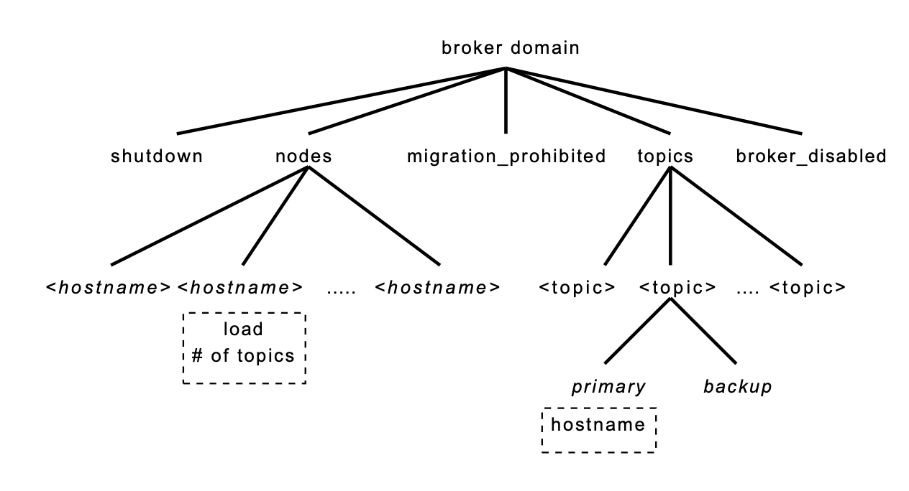
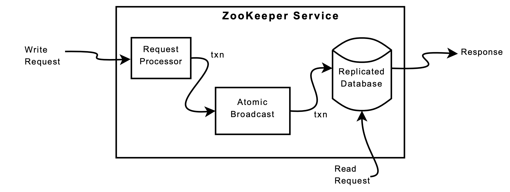

## Lecture-10：ZooKeeper

[paper](https://pdos.csail.mit.edu/6.824/papers/zookeeper.pdf)

ZooKeeper is a service for coordinating processes of distributed applications. It incorporates elements from group messaging, shared registers, and distributed lock services in a replicated, centralized service.

### Introduction

Large-scale distributed applications require differnt forms of coordination. 

- Configuration is one of the most basic forms of coordination. In its simplest form, configuration is just a list of operational parameters for the system processes.
- Group membership and leader election
- Locks

When designing the API of ZooKeeper, we moved away from blocking primitives like locks. It implements an API that manipulates simple *wait-free* data objects organized hierarchically as in file systems.

Although the wait-free property is important for performance and fault tolerance, it is not sufficient for coordination. We have also to provide **order guarantees** for operations. In particular, we have found that guaranteeing both *FIFO client ordering* of all operations and *linearizable writes* enables an efficient implementation of the service and it is sufficient to implement coordination primitives of interest to our applications.

- Guaranteeing FIFO client order enables clients to submit operations asynchronously. A client is able to have multiple outstanding operations at a time.
- To guarantee that update operations satisfy linearizability, we implement a leader-based atomic broadcast protocol called Zab. In ZooKeeper, servers process read operations locally, and we do not use Zab to totally order them.

**Caching data** on the client side is an important technique to increase the performance of reads. ZooKeeper uses a **watch mechanisms** to enable clients to cache data without managing the client cache directly. With this mechanism, a client can watch for an update to a given data object, and receive a notification upon an update. 

To summarize, in this paper our main contributions are:

- **Coordination kernel**: We propose a wait-free coordination service with relaxed consistenct guarantees for use in distributed systems.
- **Coordination recipes**
- **Experience with Coordination**

### ZooKeeper service

Clients submit requests to ZooKeeper through a client API using a ZooKeeper client library.

We. use *client* to denote a user of the ZooKeeper service, *server* to denote a process providing the ZooKeeper service, and *znode* to denote an in-memory data node in the ZooKeeper data. Clients establish a *session* when they connect to ZooKeeper and obtain a session hadle through which they issue requests.

#### Overview

ZooKeeper provides its clients the abstraction of a set of data node(znodes). The znodes in this hierarchy are data objects that clients manipulate through the ZooKeeper API. To refer a given znode, we use the standard UNIx notation for file system paths. Eg. we use `/A/B/C` to denote the path to znode C.

There are two types of znodes that a client can create:

- **Regular**: Clients manipulate regular znodes bt creating and deleting them explicitly.
- **Ephemeral**: Clients create such znodes, and they either delete them explicitly, or let the system remove them automatically when the session that creates them terminates.

Additionally, when creating a new znode, a client can set a  *sequential* flag. If `n` is the new znode and `p` is the parent znode, then the sequence value of `n` is never smaller than the value in the name of any other sequential znode ever created under `p`.

ZooKeeper implements watches to allow clients to receive timely notificatios of changes without requiring polling. Watches indicated that a change has happened but do not provide the change.

**Data model** :The data model of ZooKeeper is essentially a file system with a simplified API and only full data reads and writes, or a key/value table with hierarchical keys. Unlike files in file systems, znodes are not designed for general data storage. Instead, znodes map to abstractions of the client application, typically corresponding to meta-data used for coordination purposes.

**Sessions**: A client connects to ZooKeeper and initiates a session. Sessions have an associated timeout. ZooKeeper considers a client faulty if it does not receive anything from its session for more than that timeout. A session ends when clients explicitly close a session handle or ZooKeeper detcts that a clients is faulty. Sessions enable a client to move transparently from one server to another within a ZooKeeper ensemble.

#### Client API

- `create(path, data, flags)`: Create a znode with path name, stores `data[]` in it, and returns thename of the new znode. `flags` enables a client to select the type of znode: regular, ephemeral, and set the sequential flag.

- `delete(path, version)`: Deletes the znode `path` if that znode is at the expected version.
- `exists(path, watch)`: Returns true if the znode with path exists, and returns false otherwise. The `watch` flag enables a client to set a watch on the znode.
- `getData(path, watch)`: Returns the data and meta-data, such as version information, associated with the znode. The ZooKeeper does not set the watch if the znode does not exist.
- `setData(path, data, version)`: Writes `data[]` to znode path if the version number is the current version of the znode.
- `getChildren(path, watch)`: Returns the set of names of the children of a znode.
- `sync(path)`: Waits for all updates pending at the start of the operation to propagate to the server that the clients is connected to. The path is currently ignored.

All methods have both a **synchronous** and an **asynchronous** version available through the API.

Note that ZooKeeper does not use handles to access znodes. Each request instead includes the full path of the znode.

Each of the update methods take an expected version number, which enables the implementation of conditional updates. If the version number is `-1`, it does not perform version checking.

#### ZooKeeper guarantees

- **Linearizable writes**: all requests that update the state of ZooKeeper are serializable and respect precedence.
- **FIFO client order**: all requests from a given client are executed in the order that they were send by the client.

The definition of linearizability is different from one originally proposed by Herlihy, and we call it ***A-linearizability*** (asynchronous linearizability). It means a client can have multiple outstanding operations rather than one at a time. We choose to **guarantee FIFO order** for our property. 

Two important requirements:

- A new leader starts making changes, other processes shouldn't use the configuration that is being changed.
- If a leader dies before the configuration has beed fullt updated, the processes should stop use the partial configuration.

With ZooKeeper, the new leader can designate a path as the ***ready* znode**, other processes will only use the configuration when the znode exists. The new leader makes the configuration changed by deleting *ready*. All of these changes can be pipelined and issued asynchronously to quickly update the configuration state.

If the leader dies before the *ready* znode is created, the other processes know that the configuration has not been finalized and do not use it.

- What happens if a process sees that *ready* exists before the new leader starts to make a change and then starts reading the configuration while the change is in progress.

If a client is watching for a change, the client will see the notification event before it sees the new state of system after the change is made.

- When clients have their own communication channels in addition to ZooKeeper, the lantency may cause some problems.

ZooKeeper provides the `sync` request: causes a server to apply all pending writes requests before processing the read without the overhead of a full write.

If a majority of ZooKeeper servers are active and communicating the service will be available. If the ZooKeeper service responds successfully to a change request, that change persists across any number of failures as long as a quorum of servers is eventually able to recover.

#### Primitives

In this section, we show how to use ZooKeeper API to implement more powerful primitives.

- **Configuration Management**

  In its simplest form configuration is stored in a znode, z~c~. Processes start up with the full pathname of z~c~. Starting processes obtain their configuration by reading z~c~ with the watch flag set to true. If the configuration in z~c~ is ever updated, the processes are notified and read the new configuration.

- **Rendezvous**

  A client may want to start a master process and several worker processes, but the client does not know ahead of time information such as addresses and ports that it can give the worker processes to connect to the master. We handle this scenatio with rendezvous znode, z~r~, which is an node created by the client. When the master starts it fills in z~r~ with information about addresses and ports it is using. When workers start, they read z~r~ with watch set to true.

- **Group membership**

  We take advantage of ephemeral nodes to implement group membership. Specifically, we use the fact that ephemeral nodes allow us to see the state of the session that created the node. Starting by designating a znode, z~g~ to represent the group. When a process member of the group starts, it creates an ephemeral child znode under z~g~. 

  After the child znode is created under z~g~ the process starts normally.

  Processes can obtain group information by simply listing the child of z~g~. 

- **Simple Locks**

  Applications using ZooKeeper usually synchronization primitives tailored to their needs. The **simplest** lock implementation uses "lock files". To acquire a lock, a client tries to create the designated znode with EPHEMERAL flag. If the create succeeds, the client holds the lock. Otherwise, the client can read the znode with the watch flag set te be notified if the current leader dies. A client releases the lock when it dies or explicitly deletes the znode. Other clients that are waiting for a lock try again to acquire a lock once they observe the znode being deleted.

- **Simple Locks without Herd Effect**

  We define a lock znode l to implement such locks. Clients wishing to obtain the lock do the following:

  ```
  Lock
  1 n = create(l + “/lock-”, EPHEMERAL|SEQUENTIAL)
  2 C = getChildren(l, false)
  3 if n is lowest znode in C, exit
  4 p = znode in C ordered just before n
  5 if exists(p, true) wait for watch event
  6 goto 2
  Unlock
  1 delete(n)
  ```

  We avoid the herd effect by only waking up one process when a lock is released or a lock request is abandoned.

  This locking scheme has the following advantages:

  1.The removal of a znode only causes one client to wake up.

  2.There is no polling or timeouts.

  3.Because of the way we have implemented locking, we can see by browsing the ZooKeeper data the amount of lock contention, break locks, and debug locking problems.

- **Read/Write Locks**

  ```
  Write Lock
  1 n = create(l + “/write-”, EPHEMERAL|SEQUENTIAL)
  2 C = getChildren(l, false)
  3 if n is lowest znode in C, exit
  4 p = znode in C ordered just before n
  5 if exists(p, true) wait for event
  6 goto 2
  Read Lock
  1 n = create(l + “/read-”, EPHEMERAL|SEQUENTIAL)
  2 C = getChildren(l, false)
  3 if no write znodes lower than n in C, exit
  4 p = write znode in C ordered just before n
  5 if exists(p, true) wait for event
  6 goto 3
  ```

  The unlock procedure is the same as the global lock case.

- Double Barrier

  We represent a barrier in ZooKeeper with a znode ,referred to as *b*. Every process *p* registers with *b* - by creating a znode as a child of *b* - on entry, and unregister - removes the child. Processes can enter the barrier when the number of child znodes of *b* exceeds the barrier threshold. Processes can leave the barrier when all of the processes have removed their children.

  Simply, the process should wait until all processes enter the barrier and wait until all processes ready to leave the barrier.

### ZooKeeper Applications

- **The Fetching Service**: FS uses ZooKeeper mainly to manage **configuration metadata**, although it also uses ZooKeeper to elect masters(**leader eletion**)
- **Katta**: Katta uses ZooKeeper to track the status of slaves servers and the master (**Group memberhsip**), and to handle master failover (**leader election**). Katta also uses ZooKeeper to track and propagate the assignments of shards to slaves (**configuration management**).
- **Yahoo! Message Broker**: YMB uses ZooKeeper to manage the distribution of topics (**configuration metadata**), deal with failures of machines in the system (**failure detection** and **group membership**), and control system operation.

### ZooKeeper Implementation

Zookeeper provides high availability by **replicating** the ZooKeeper data on each server that composes the service.

The replicated database is an *in-memory* database containing the entrie data tree. Each znode in the tree stores a maximum of 1MB of data by default.

Every ZooKeeper server services clients. Clients connect to exactly one server to submit its request. Read requests are serviced from the local replica. Requests that change the state of the service, write requests, are processed by an agreement protocol.

As part of the agreement protocol write requests are forwarded to a single server, called the *leader*. The rest servers receive message proposals consisting of state changes from the leader and agree upon state changes.

#### Request Processor

Since the messaging layer is atomic, we guarantee that the local replicas **never diverge**. 

#### Atomic Broadcast

All requests that update ZooKeeper state are forwarded to the leader. The leader executes the request and broadcasts the change to the ZooKeeper state through Zab, an atomic broadcast protocol. Zab uses by default simple majority quorums to decide on a proposal.

Zab **guarantees** that changes broadcast by a leader are delivered in the order they were sent and all changes before it broadcasts its own changes.

We use the log to keep track of proposals as the write-ahead log for the in-memory database.

Zab may redeliver a message during recovery. Because we use idempotent transactions, multiple delivery is acceptable as long as they are delivered in order. ZooKeeper requires Zab to redeliver at least all messages that were delivered after the start of the last snapshot.

#### Replicated Database

ZooKeeper uses periodic snapshots and only requires redelivery of messages since the start of the snapshot. We call ZooKeeper snapshot ***fuzzy snapshots*** since we **do not lock** the ZooKeeper state to take the snapshot. Instead, do a depth first scan of the tree atomically reading each znode's data and meta-data and writing them to disk. The fuzzy snapshot may have applied some subset of the state changes delivered during the genereation of the snapshot, the result may not correspond to the state at any point. However, the state changes are idempotent, we can apply them twice in order.

#### Client-Server Interactions

When a server processes a write request, it also sends out and clears notification relative to any watch that corresponds to that update. Servers process writes in order and do not process other writes or reads concurrently.

**Read requests** are handled locally at each server. Each read request is processed an tagged with a ***zxid*** that corresponds to the last transaction seen by the server. This *zxid* defines the partiial order of the read requests with respect to the writes requests.

To guarantee that a given read operation returns the latest updated value, a client calls `sync` followed by the read operation. In our implementation, we do not need to atomically broadcast `sync` as we use a leader-based algorithm, and we simply place the `sync` operation at the end of the queue of requests between the leader and the server executing the call to `sync`. The follower must be sure that the leader is still the leader. If there are pendinf transactions that commit, then the server does not suspect the leader. If the pending queue is empty, the leader needs to issue a null transaction to commit and orders the `sync` after that transaction.

ZooKeeper servers process requests from clients in FIFO order. Responses include the *zxid* that the response is relative to. If the client connects to a **new** server, that new server ensures that its view of the ZooKeeper data is at least as recent as the view of the client by checking the last *zxid* of the client against its last *zxid*. If the client has a more recent view than the server, the server does not reestablish the session with the client until the server has caught up.

To detect client session failures, ZooKeeper uses timeouts. The leader determines that there has been a failure if no other server receives anything from a client session within the session timeout. If the client cannot communicate with a server to send a request or heartbeat, it connects to a different ZooKeeper server to re-establish its session.

