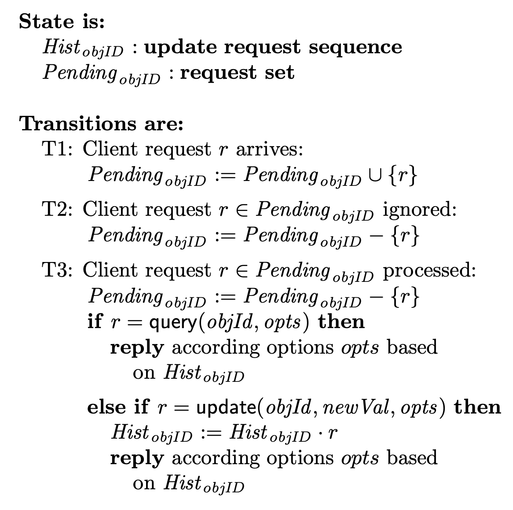
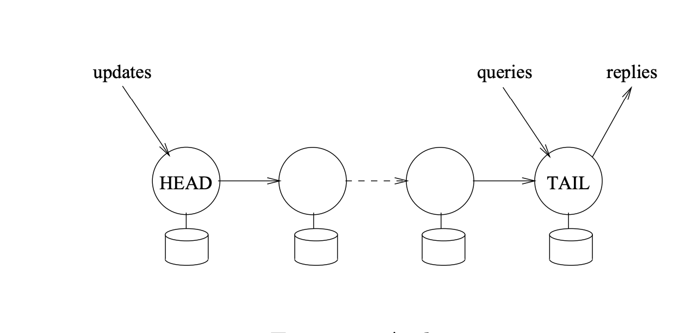

## Lecture-11: Chain Replication

Chain replication is a new approach to coordinating clusters of fail-stop storage servers.

### Introduction

A *storage system* typically implements operations so that clients can store, retrieve and change data.

We are concerned with storage services below:

- Store objects.
- Support *query* operations.
- Support *update* operations to atomically change the state.

Strong consistency guarantees are often thought to be in tension with achieving high throughput and availability, chain replication supports the all.

### Storage Service Interface

Clients are better off if the storage service simply generates a for each request it receives and completes.

- `query(objId, opts)`
- `update(objId, newVal, opts)`

Query operations are **idempotent**, but update operations need not be.

A client request that is **lost** before reaching the storage service is indistinguishable to that client from one that is ignored by the storage serveice. This means that clients would not be exposed ti a new failure mode when a storage server exhibits transient outages during which client requests are ignored.

With chain replication, the duration of each transient outage is **far shorter** than the tine required to remove a faulty host or to add a new host. So, client request processing proceeds with minimal disruption in the face of failure, recovery, and other reconfiguration.

We specify the functionality of out storage service by giving the **client view of an object's state**. The figure defines the state of *objID* in terms of two variables: the sequence *Hist~objID~* of **updates** that have been performed on *objID* and a set *Pending~objID~* of **unprocessed requests**.

### Chain Replication Protocol

Servers are assumed to be fail-stop:

- Each server halts in response to a failure ratehr than making erroneous state transitions.
- A server's halted state can be detected by the environment.

With an object replicated on `t` servers, we assume that at most `t - 1` of the servers replicating an object fail concurrently.

In chain replication, the servers replicating a given object *objID* are linearly ordered to form a *chain*.

The first server in the chain is called the `head`, the last server is called the `tail`, and request processing is implemented by the servers roughly as follows:

- **Reply Generaion**: The reply for every request is generated and sent by the tail.
- **Query Processing**: Each query request is directed to the tail of the chain and process there atomically using the replica of *objID* and stored at the tail.
- **Update Processing** Each update request is direceted to the head of the chain. The request is processed there atomically using replica of *objID* at the head, then state changes are forwarded along a reliable FIFO link to the next element of the chain, and so on until the request is handled by the tail.

#### Protocol Details

Clients do not directly read or write variables *Hist~objID~* and *Pending~objID~*, so we are free to implement them in any way that is convenient.

- *Hist~objID~* is defined to be *Hist^T^~objID~*, the value of *Hist~objID~* stored by tail T of yhe chain.
- *Pending~objID~* us defined to be the set of client requests received by any server in the chain and not yet processed by the tail.

We observe that the only server transitions affecting *Hist~objID~* and *Pending~objID~* are: (i) a server in the chain receiving a request from a client, and (ii) the tail precessing a client request.

- **Client Request Arrives at Chain**

  Clients send requests to either the head(update) or the tail(query). Receipt of a request *r* are added to *Pending~objID~*, and this is consistent with T1.

- **Request Processed by Tail**

  Execution causes the request to be removed from *Pending~objID~* --the first step of T3. Moreover, the processing of that request by tail T uses replica *Hist^T^~objID~*. The remaining steps of T3.

#### Coping with Server Failures

The chain is reconfigured to eliminate the failed server. For this purpose,we emply a service, called the ***master***:

- detects failures of servers
- informs each server in the chain of its new predecessor or new successor in the new chain obtained by deleting the failed server
- Inform clients which server is the head and which is the tail of the chain.

In the following, we assume the master is a single process that **never fails**. This simplifies the exposition but is not a realistic assumption. Out prototype implementation of chain replication acturally **replicates a master process on multiple hosts**, using Paxos to coordinate those replicas.

The master distinguishes three cases: (i) failure of the head, (ii) failure of the tail, and (iii) failure of some other server in the chain.

- **Updata propagation Invariant**: For servers labeled *i* and *j* such that i ≤ *j* holds then:
  $$
  Hist_{objID}^j \preceq Hist_{objID}^i
  $$

- **Failure of the Head**: This case is handled by master removing head from the chain and making the successor to head the new head of the chain.

- **Failure of the Tail**: This case is handled by removing tail T from the chain and making predecessor T^-^ of T the new tail of the chain.

- **Failure of Other Servers**: Deleting S from the chain. The master first informs S's successor S^+^ of the new chain configuration and then informs S's predecessor S^-^. S^-^ needto send requests in Hist^S-^~objID~ that might not have reached S^+^.

Each server *i* maintains a list *Sent~i~* of update requests that *i* has forwarded to some successor but that might not have been proceeded by the tail. Whenever server *i* forwards an update request *r* to its successor, server *i* also **appends** *r* to *Sent~i~*. The tail sends an acknowledgement *ack(r)* to its predecessor when it completes the processing of update request *r*. And upon receipt *ack(r)*, a server *i* **delete** *r* from *Sent~i~* and forwards *ack(r)* to its predecessor.

**Inprocess Requests Invariant**. If i ≤ j then
$$
Hist^i_{objID} = Hist^j_{objID} \bigoplus Sent_i
$$

- **Extending a Chain**:

  A new server could ,in theory, be added anywhere in a chain. In practice, adding a server T^+^ to the very end of a chain seems simplest. For a tail T^+^, the value of *Sent~T+~* is trivial. All that remains is to initializa local object replica *Hist^T+^~objID~* in a way that satisfies the Update Propagation Invariant.
  $$
  Hist^T_{objID} = Hist^{T^+}_{objID} \bigoplus Sent_T
  $$
  Inprocess Requests Invariant is established and T^+^ can begin serving as the chain's tail:

  - T is notified that it no longer is the tail. T is thereafter free to discard query requests it receives from clients.
  - Requests in *Sent~T~* are sent to T^+^.
  - The master is notified that T^+^ is the new tail.
  - Clients are notified that query requests should be directed to T^+^

### Primary/Backup Protocols

In the primary/backup approach, one server, designated the *primary*

- Imposes a sequencing on client request
- Distributed to other servers, known as *backups*, the client requests or resulting updates.
- Awaits acknowledgements from all non-faulty backups.
- After receiving those acknowledgements then send a reply to the client.

If the primary fails, one of the back-ups is promoted into that role.

With chain replication, the primary's role in sequencing requests is shared by **two replicas**. The head sequences update requests; the tail extend that sequence by interleaving query requests. This sharing enables **lower-lantency** and **lower-overhead** because only a single server is involved in processing a query. Compare that to the primary backup approach, where the primary, before responding to a query, must await acknowledgements from backups for prior updates.

In both chain replication and in the primary/backup approach, update requests must be disseminated to all servers. Chain replication does this dissemination **serially**, resulting in **higher latency** than the primary/backupa approach where requests were distributed to backups **in parallel**.

The **delay ro detect a server failure** is by far the dominant cost, and this cost is identical for both chain replication and primary/backup approach. What follows, is an analysis of the **recovery costs** for each approach. Message delays are presumed to be the dominant source of protocol latency.

For chain replicatoin, there are three cases to consider:

- **Head Failure**. Query processing continues uninterrupted. Update processing is unavailable for 2 message delivery delays while the master broadcasts a message to the new head and its successor.
- **Middle Server Failure**. Query processing continues uninterrupted. Update processing can be delayed but update requests are not lost, hence no transient outage is experienced. Failure of a middle server can lead to a delay in processing an update request (4 message delivery delays).
- **Tail Failure**. Query and update processing a re both unavailable for 2 message delivery delays .

With the primary/backup approach, there are two cases to consider:

- **Primary Failure**. A transient outage of 5 message delays is experienced.
  - The master detects the failure and broadcasts a message to all backups, requesting the number of updates and telling them to suspend.
  - Each backup replies to the master.
  - The master broadcasts the identity of the new primaty to all backups.
  - The new primary is the one habing processed the largest number of updates, and it then forward to the backups any updates that they are missing.
  - The master broadcasts a message notifting all clients of the new primary.
- **Backup Failure**. Query processing continues uninterrupted provided no update requests are in progress. If an update request is in progress then a transient outage of at most 1 message delay is experienced while the master sends a message to the primary indicating that acknowledgements will not be forthcoming from the faulty backup.

So the worst case outage for chain replication (tail failure) is never as long as the worst case outage for primary/backup (primary failure). And the best case for chain replication (middle server failure) is shorter than the best case outage for primary/backup (backup failure).