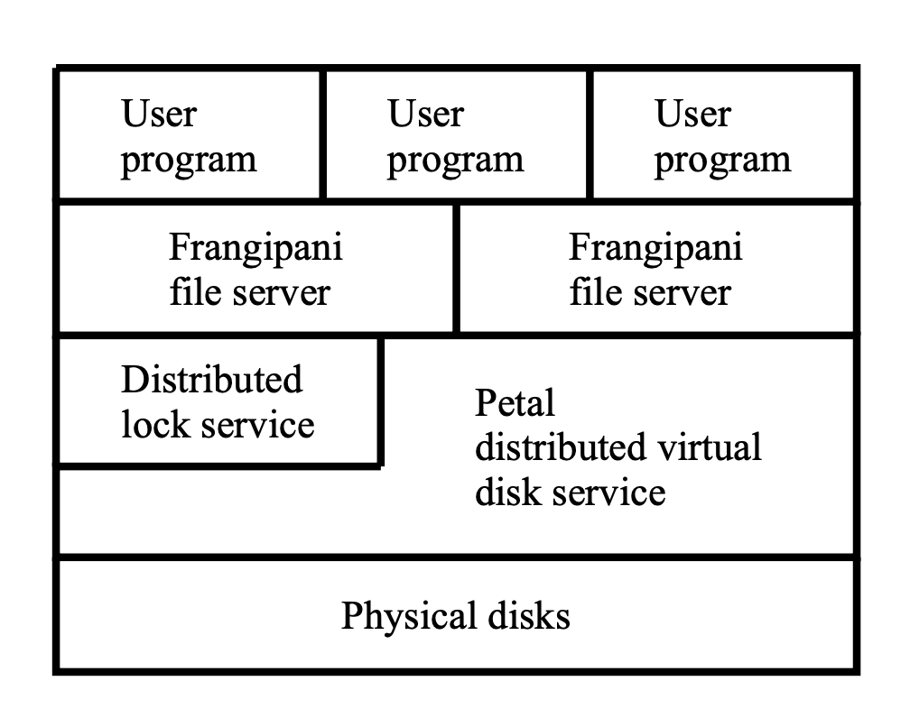
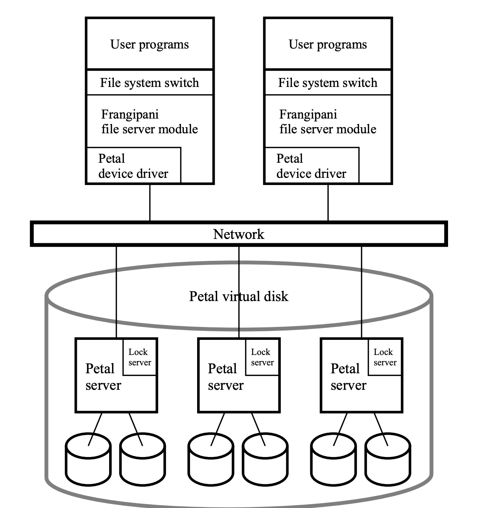
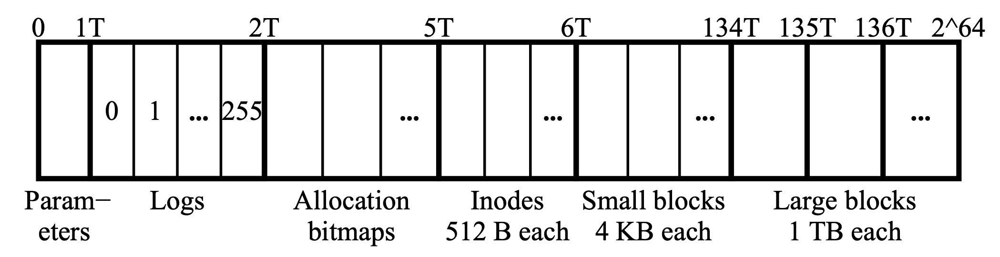

## Lecture-13: Cache Consistency: Frangipani

Frangipani: A scalable distributed system.

Frangipani has two-layer structure:

- Low layer is Petal, a disrtibuted storage service that provides invrementally scalable, highly available, automatically managed virtual disks.
- In the upper layer, multiple machines run the same Frangipani file system ode on top of a sharded Petal virtual disk, using a distributed lock service to ensure coherence.

### Introduction

One distinguishing feature of Frangipani is that it has a very simple internel structure (a set of cooperating machines use a common store and synchronize access to that store with locks). 

Another key aspect of Frangipani is that it combines a set of features that makes it easier to use and administer Frangipani than existing file systems we know of.

- All users are given a consistent view of the same set of files.
- More servers can easily be added to an existing Frangipani  installation to increase its storage capacity and throughput, without changing the configuration of existing servers, or interrupting their operation.
- A system administrator can add new users without concern for which machines will manage their data or which disks will store it.
- A system administrator can make a full and consistent backup of the entire file system without bringing it down, Backups can optionally be kept online, allowing users quick access to accidently deleted files.
- The file system tolerates and recovers from machine, network, and disk failures without operator intervention.

Frangipani is layered on top of **Petal**, an easy-to-administer distributed storage system that **provides virtual disks** to its clients.

#### Frangipani layering

Multiple interchangeable Frangipani servers provide access to the same files by running on top of a shared Petal virtual disk. The file system layer can be scaled up by adding Frangipani servers. 

### System Structure

#### Components

User programs access Frangipani through the standard operating system call interface. Programs running on different machines all see the same files. Changes made to a file or directory on one machine are immeditely visable on all others. Changes to file contents are staged through the local kernel buffer pool and are not guaranteed to reach nonvolatile storage until the next applicable `fsync` or `sync` system call.

The Frangipani file server module uses the kernel's buffer pool to cache data from recently used files. It reads and writes Petal virtual disks using the local Petal device driver. Each server keeps its own redo log of pending cahnges in a distinct section of the Petal disk. The Frangipani servers have no need to communicate directly with one another; they communicate only with Petal and the lock service.

The Petal device driver hides the distributed nature of Petal, making Petal look like an ordinaty local disk to higher layers of the operating system.

The Petal servers run cooperatively to provide Frangipani with large, scalable, fault-tolerant virtual disks, implemented on top of the ordinary physical disks connected to each server. Petal can tolerate one or more disk or server failures, as long as a majority of the Petal servers remain up and at least one copy of each data block remains physically accessibale.

The lock service is a general-purpose service that provides multiple-reader/single-writer locks to clients on the network.

#### Security adn the Client/Server Configuration

Any Frangipani machine can read or write any block of the shared Petal virtual disk, so Frangipani must run only on machines with trusted operating systems.

One could fully solve these problems by placing the machines in an environment that prevents users from booting modified operating system kernels on them, and interconnecting them with a private network that user processes are not granted access to. 

### Disk Layout

A Petal virtual disk has **2^64^** bytes of address space. To Keep its internal data structures small, Petal commits and decommits space in fairly large chunks, currently **64KB**. Each 64KB range of addresses in which some data has been written and not decommitted has 64KB of physical disk space allocated to it.

- The first region stores shared **configuration parameters and housekeeping information**. We allow one terabyte of virtual space for this region, but in fact only a few kilobytes of it are currently used.
-  The second region stores **logs**. We have reserved one TB for this region, partitioned into 256 logs. 
- The third region is used for allocation **bitmaps**, to describe which blocks in the remaining regions are free.
- The fourth region holds **inodes**. Each file needs an inode to hold its metadata.
- The fifth region holds **small data blocks**, each 4KB in size. The first 64KB(16 blocks) of a file are stored in small blocks. If a file grows to more than 64KB, the rest is stored in one large block.
- The remainder of the Petal address space holds large data blocks.

The current scheme limits Frangipani to slightly less than 2^24^  large files, where a large file is any file bigger than 64KB. Also, no file can be larger than 16 small blocks plus one large block. 

### Logging and Recovery

Frangipani uses **write-ahead redo logging** of metadata to simplify failure recovery and improve performance; user data is not logged. Each Frangipani has its own private log in Petal. 

When a Frangipani file server need to make a metadata update:

- First creates a record describing the update and appends it to its lof in memory.
- These log records are periodically written out to Petal *in the same order* that the updates they describe were requested.
- After a log record is written to Petal does the server modify the actual metadata in its permanent locations.
- The permanent locations are updated periodically by the Unix `update` demon.

Logs are bounded in size (128KB in the current implementation). Given Petal's allocation policy, a log will be composed of two 64KB fragments on two distinct physical disks. The space allocated for each log is managed as a circular buffer. When the log fills, Frangipani reclaims the oldest 25% of the log space for new log entries.

If a Frangipani server crashes, the system eventually detects the failure and runs *recovery* on that server's log.

### Synchronization and Cache Coherence

Frangipani uses multiple-reader/single writer locks to implement the necessary synchronization.

A **read lock** allows a server to read the associated data from disk and cache it. If a server is asked to release its read lock, it must invalidate its cache entry before complying.

A **write lock** allows a server to read or write the associated data and cache it. If a server is asked to release its write lock or downgrade it to read lock, it must write the dirty data to disk before comlying.

Rules:

- don't cache unless you hold the lock
- acquire lock, then read from Petal
- write to Petal, then release lock

We have divided the on-disk structures into logical segments with locks for each segment. To avoid false sharing, we ensure that a single disk sector does not hold more than one data structure that could be shared.

Each log is a single lockable segment, because logs are private. The bitmap space is alse divided into segments that are locked exclusively. A data block or inode that is not currently allocated to a file is protected by the lock on the segment of the allocated bitmap that holds the bit marking it as free. Each file, directory, or symbolic link is one segment.

We avoid deadlock by globally ordering these locks and acquiring them in two phases.

- First, a server determines what locks it need.
- Second, it sorts the locks by inode address and acquires each lock in turn.
- The server then checks whether any objects it examined in phase one were modified while their locks were released.

### The Lock Service

Frangipani requires only a small, generic set of functions from its lock service, and we do not expect the service to be a performance bottleneck in normal operations. 

- The lock service provides multiple-reader/single-writer locks. Locks are sticky.  A client will generally retain a lock until some other client needs a conflicting one.
- The lock service deals with client failure using *leases*. When a client first contacts the lock service, it obtains a lease. All locks the client acquires are associated with the lease. Each lease has an expiration time, currently set to 30 seconds after its creation or last renewal. A client must renew its lease before the expiration time, or the service will consider it to have failed.
  - Network failures can prevent a Frangipani server from renewing its lease even though it has not crashed. When this happends, the server discards all its locks and the data in its cache. If anything in the cache was dirty, Frangipani turns on an internal flag that causes all subsequent requests from user programs to return an error.

We have used three different lock service implementations.

- The initial lock service implementations was a single, centralized server that kept all its lock state in volatile memory. Such a server is adequate for Frangipani, because the Frangipani servers and their logs houold enough state information to permit recovery. However, a lock service failure would cause a large performance glitch.
- The second implementation stored the lock state on a Petal virtual disk, writing each lock state change through to Petal before returning to the client. If the primary lock server. crashed, a backup server would read the current state from Petal and take over to provide continued service.
- The **final** lock service implementation is fully disributed for fault tolerance and scalable performance. It contains a set of mutually cooperating lock servers, and a clerk module linked into each Frangipani server.
  - The lock service organizes locks into *tables* named by ASCII strings. Individual locks within tables are named by 64-bit intergers. Each file system has a table associated with it. When a Frangipani file system is mounted, the Frangipani server calls into the clerk, which opens the lock table associated with that file system. The lock server gives the clerk a *lease identifier* on a successful open. When the file system is unmounted,  the clerk closes the lock table.
  - Clerks and the lock server s communicate via asynchronous messages rather than RPC to minimize the amount of memory used and to achieve good flexibility and perrformance. The basic message types that operate on locks are ***request, grant, revole, and release*.** The *requets* and *release* message types are sent from the clerk to the lock server, whereas the *grant* and *revoke* message types are sent from the lock server to the clerk.
  - The lock service uses a fault-tolerant, distributed failure deteciton mechanism to detect the crash of lock servers. It is based on the timely exchange of heartbeat messages betweent sets of servers. It uses majority consensus to tolerate network partitions.

When a Frangipani server **crashes**, the locks that it owns cannot be released until appropriate recovery actions have been performed.

In general, the Frangipani system tolerates network partitions, continuing to operate when possible and otherwise shutting down cleanly.

### Backup

Petal's snapshot copy appears identical to an ordinary virtual disk, except that it cannot be modified. The implementation uses copy-on-write techniques for efficiency. The snapshots are *crash-consistent*.

The snapshot cna be restored by copying it back to a new Petal virtual disk and running recovery on each log.