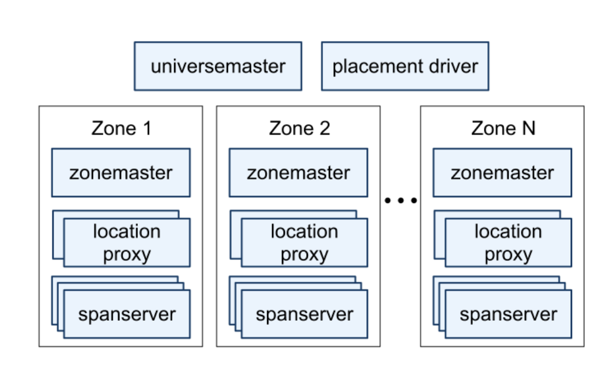
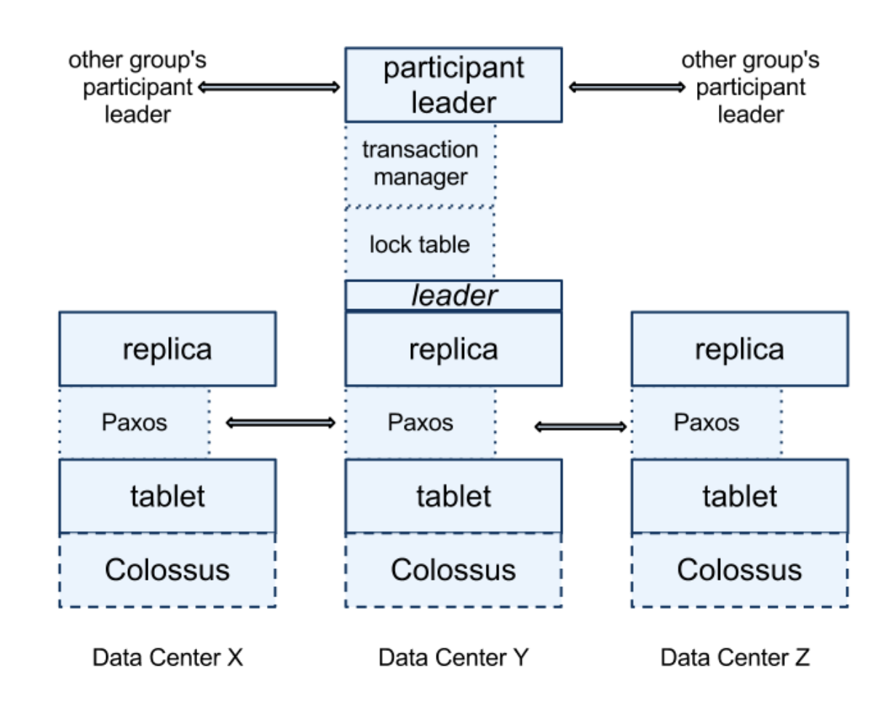
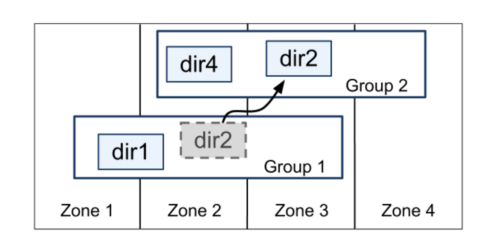
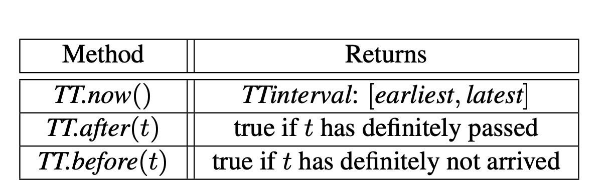
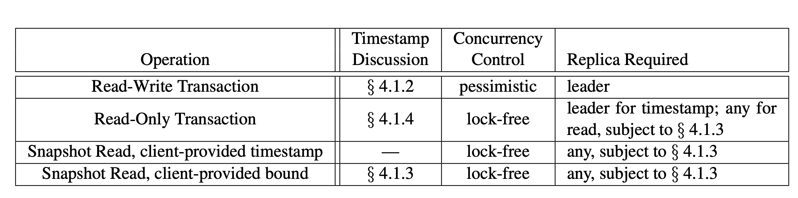

## Lecture-14: Spanner

### Introduction

Spanner is a database that shards dataacross many sets of Paxos state machines in data centers spread all over the world.

Spanner's main focus is managing cross-datacenter replicated data, but we have also spent a great deal of time in designing and implementing important database features on top of our distributed-systems infrastructure.

Spanner has evolved from a Bigtable-like versioned key-value store into a temporal multi-version database. Data is stored in schematized **semi-relational** tables; data is **versioned**, and each version is automatically timestamped with its commit time; old version of data are subject to configurable garbage-collection policies; and applications can read data at old timestamps. Spanner supports general-purpose transactions, and provides a SQL-based query language.

As a globally-distributed database, Spanner provides several interesting features.

- The replication configurations for data can be dynamically controlled at a fine grain by applications. Applications can specify constraints to control which datacenters contain which data (latenct, durability, availability, read performance). 

- Spanner has two features that are difficult to implement in a distribued database: it provides externally consistent reads and writes, and globally-consistent reads across the database at timestamp.

  These features enable Spanner to support consistent backups, consistent MapReduce executions.

The key enabler of these properies is a **new TrueTime API** and its implementation. The API directly exposes clock uncertainty. If the uncertainty is large, Spanner slows down to wait out that uncertainty. Google's cluster-management uses multiple modern clock referencesto keep uncertainty small (less than 10ms).

### Implementation

A Spanner deployment is called a **universe**. There will be only a handful of running universes. We currently run a test/playground universe, a development/production universe, and a production-only universe.

Spanner is organized as a set of **zones**, where each zone is the rough analog of a deployment of Bigtable servers. The set of zones is also the set of locations across which data can be replicated.



A zone has one **zonemaster** and between one hundred and several thousand **spanservers**. The formal assigns data to spanservers; the latter serve data to clients. The **location proxies** are used by clients to locate the spanservers assigned to serve their data. The **universe master** is primarily a console that displays status information about all the zones for interactive debugging. The **placement driver** handles automated movement of data across zones on the timescall of minutes. It periodically communicates with the spanservers to find that needs to be moved.

#### Spanserver Software Stack



At the bottom, each spanserver is responsible for between 100 and 1000 instances of a data structure called a **tablet**. A tablet is similar to Bigtable's tablet abstraction.`(key:string, timestamp:int64)->string`

Unlike Bigtable, Spanner **assigns timestamps to data**, so that Spanner is mroe like a multi-version database than a key-value store. A tablet's state is stored in set of B-tree-like files and a write-ahead log, all on a distributed file system called **Colossus**.

Each spanserver implements **a single Paxos state machine on top of each tablet**. Each state machine stores its metadata and log in its corresponding tablets. The current Spanner implementation logs every Paxos write **twice**: once in the tablet's log, and once in the Paxos log.

The Paxos state machines are used to implement a consistently replicated bag of mappings. The key-value mapping state of each replica is stored in its corresponding tablet.

At every replica that is a **leader**, each spanserver implements a **lock table** to implement concurrency control. The lock table contains the state for **two-phase** locking.

At every replica that is a leader, each spanserver also implements a **transaction manager** to support distributed transactions. The transaction manager is used to implement a **participant leader**; the other replicas in the group will be referred to as **participant slaves**. 

#### Directories and Placement

The Spanner implementaion supports a bucketing absraction called a **directory**, which is a set of contiguous keys that share a common prefix.

All data in a directory has the same replication configuration. When data is moved between Paxos groups, it is moved directory by directory.

`Movedir` is the background task used to move directories between Paxos groups. Movedir registers the fact that it is starting to move data and moves the data in the background. When it has moved all but a nominal amount of data, it uses a transaction to atomically move that nominak amount and update the metadata for the two Paxos groups.

Administrators control two dimensions: the number and types of replicas. They create a menu of named options in these two dimensions. 

In fact, Spanner will shard a directory into multiple **fragments** if it grows too large. Movedir actually move fragments, and not whole directories, between groups.

#### Data Model

Spanner exposes the following set of data features to applications: a data model based on **schematized semi-relational tables**, **a query language**, and **general-purpose transactions**. The need to support schematized semi-relational tables and synchronous replication is supported by the popularity of **Megastore**.

#### TrueTime



`TTinterval` is an interval with bounded time uncertainty. The endpoints of a `TTinterval` are of type `TTstamp`. 

### Concurrency Control

#### 4.1 Timestamp Management



##### 4.1.1 Paxos Leader Leases

Spanner'x Paxos implementation uses timed leases to make leadership long-lived.

The Spanner implementation permits a Paxos leader to abdicate by releasing its slaves from their lease votes. Define *s~max~* to be the maximum timestamp used by a leader. Subsequent sections will describe when *s~max~* is advanced. **Before abdicating, a leader must wait until *TT.after(s~max~)* is true.**

##### 4.1.2 Assigning Timestamps to RW Transactions

Transactional reads and writes use two-phase locking. As a result, they can be assigned timestamp at any time when all locks have been acquired.

- Spanner assigns timestamps to Paxos writes in monotonically increasing order, even across leaders. **A leader must only assign timestamps within the interval of its leader lease.** Note that whenever a timestamp is assigned, *s~max~* is advanced to *s* to preserce disjointness.

- Spanner also enforces the following external consistency invariant:

  If the start of a transaction **T~2~** occurs after the commit of a transaction **T~1~** then the commit timestamp of **T~2~** must be greater than **T~1~**.

  **Start** The coordinator leader for a write **T~i~** assigns a commit timestamp **s~i~** no less than the value of *TT.now().latest*, computed after **e~i~^server^**.

  **Commit Wait** The coordinator leader ensures that clients cannot see any data committed by **T~i~** until *TT.after(s~i~)* is true. Commit wait ensures that **s~i~** is less than the absolute commit time of **T~i~**.

##### 4.1.3 Serving Reads at a Timestamp

Every replica tracks a value called **safe time t~safe~** which is the maximum timestamp at which a replica is up-to-date. A replica can satisfy a read at a timestamp t if t <= t~safe~.

Define **t~safe~ = min(t~safe~^Paxos^, t~safe~^TM^)**, where each Paxos state machine has a safe time t~safe~^Paxos^ and each transaction manager has a safe time t~safe~^TM^. 

t~safe~^Paxos^ is the timestamp of the **highest-applied Paxos write**.

t~safe~^TM^ is ∞ at a replica if there are zero prepared transactions. For every replica in a group, over all transactions T~i~ prepared at group, t~safe~^TM^ = min~i~(s~i,g~^prepare^) - 1 over all transactions prepared at group.

##### 4.1.4 Assigning Timestamps to RO Transactions

A read-only transaction executes in two phases: assign a timestamp **s~read~**, and then execute the transaction's reads as **snapshot** reads at s~read~. 

The simple assignment of s~read~ = *TT.now().latest*.

Snapshot Isolation gives you serializable r/o transactions.

##### 4.2.1 Read-Write Transactions

Reads within read-write transactions use wound-wait to avoid deadlocks. While a client transaction remains open, it sends keepalive messages to prevent participant leaders from timing out its transaction. When a client has completed all reads and buffered all writes, it begins two-phase commit. The client chooses a coordinator group and sends a commit message to each participant's leader with the identity of the coordinator and any buffered writes.

A non-coordinator-participant leader first acquires write locks. It then **chooses a prepare timestamp** that must be larger than any timestampts it has assigned previous transactions, and logs a prepare record through Paxos. Each participant then **notifies the coordinator of its prepare timestamp**.

The coordinator leader also first **acquires write locks, but skips the prepare phase**. It chooses a timestamp for the entire transaction after hearing from all other participant leaders. The commit timestamp **s** must be greater or equal to all prepare timestamps, greater than **TT.now().lastest** and greater than any timestamps the leader has assigned to previous transactions. The coordinator then logs a commit record through Paxos

Before allowing any coordinator replica to apply the commit record, the coordinator leader waits until TT.after(s). After commit wait, the coordinator sends the commit timestamp to the client and all other participant leaders.

```
Client picks a unique transaction id(TID)
Client sends each read to Paxos leader of relevant shard
	Each shard first acquires a lock on the relevant record
	Separete lock table per shard, in shard leader.
	Read locks are not replicated via Paxos, so leader failure -> abort.
Client keeps write provate until commit.
When client commit:
	Choose a Paxos group to act as 2pc Transaction Coordinator (TC)
	Sends writes to relevant shard leaders.
	Each written shard leader:
		Acquires lock on the written record.
		Log a "prepare" record via Paxos, to replicate lock and new value.
		Tell TC it is prepared.
		Or tell TC "no" if crashed and thus lost lock table.
Transaction Coordinator:
	Decides commit or abort.
	Logs the decision to its group via Paxos.
	Tell participant leaders and client the result.
Each participant leader:
	Log the TC's decision via Paxos.
	Perform its writes.
	Release the transaction's lock.
```

##### 4.2.2 Read-Only Transactions

Spanner requires a **scope** expression for every read-only transaction, which is an expression that summarizes the keys that will be read by the entire transaction.

Define **LastTS()** to be the timestamp of the last committed write at a Paxos group.

If the scope's values are served by a single Paxos group, then the client issues the read-only transaction to that group's leader. The leader assigns s~read~ and executes the read.  If there are no prepared transactions, the assignment s~read~ = LastTS() trivially satisfies external consistency: the transaction will see the result of the last write, and therefore be ordered after it.

If the scope's value are served by multiple Paxos groups, there are several options. The most comlicated option is to do a round of communication with all of the group's leaders to negotiate s~read~ based on LastTS(). Spanner currently implements a simpler choice. The clients avoids a negotiatin round, and just has its reads execute at **s~read~ = TT.now().lastest**. All reads in the transaction can be sent to replicas that are sufficiently up-to-date.

##### 4.2.3 Scheme-Change Transactions

A Spanner schema-change transaction is a generally non-blocking variant of a standard transaction.

- It is explicitly assigned a timestmap in the future, which is registered in the prepare phase. As a result, schema changes across thousands of servers can complete with minimal disruption to other concurrent activity.
- Reads and writes, which implicitly depend on the schema, synchronize with any registered schema-change timestamp at time t: they may proceed if their timestamp precede t, but they must block behind the schema-change transaction if their timestamp are after t.

### 
