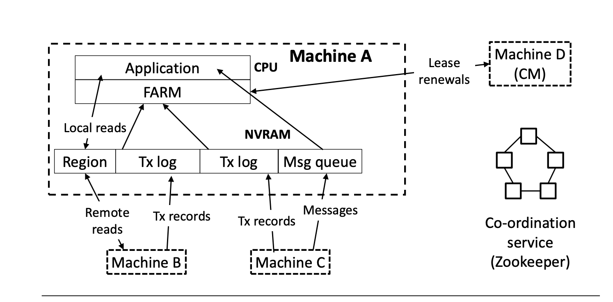
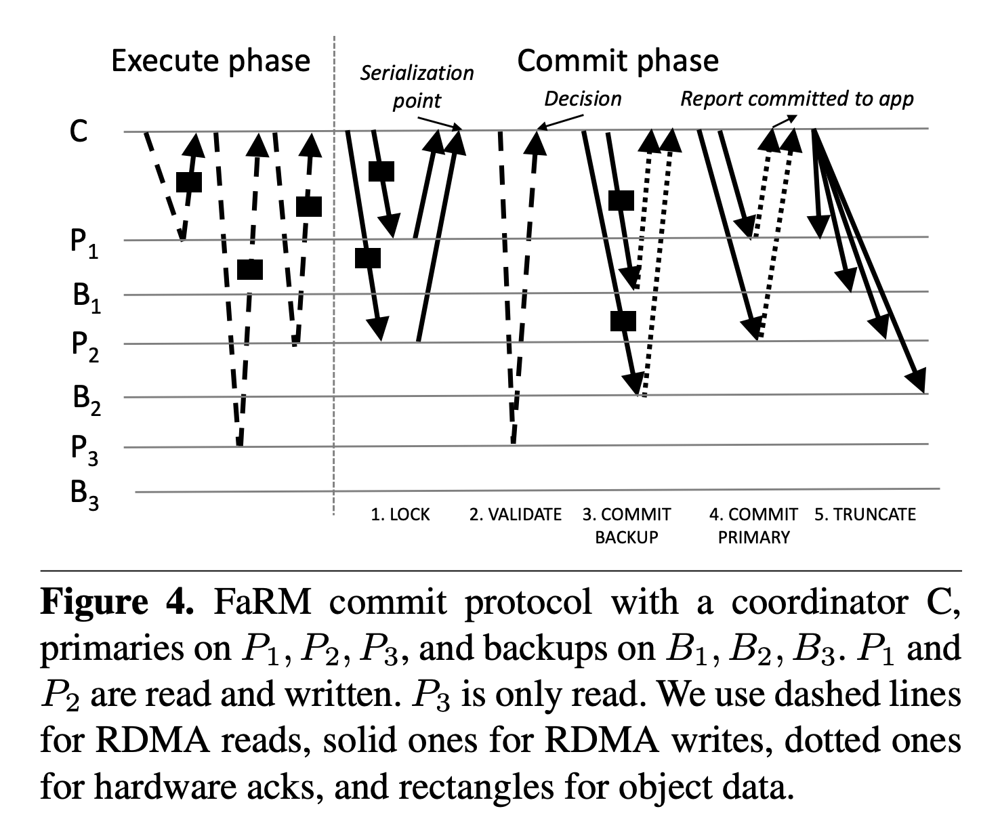
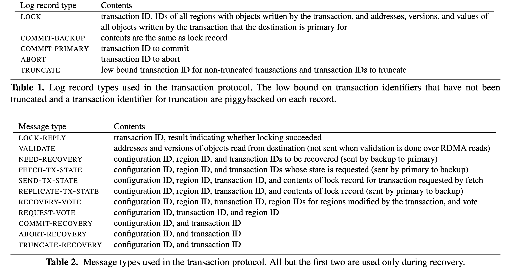
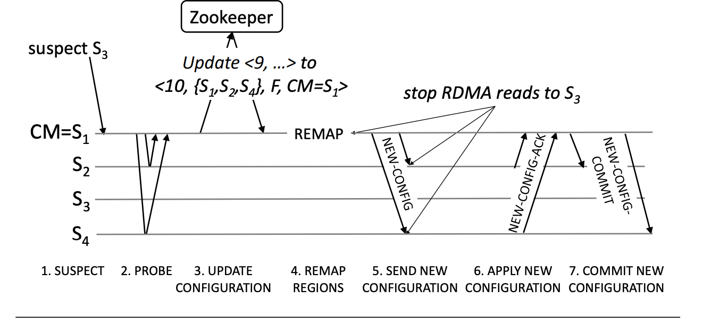
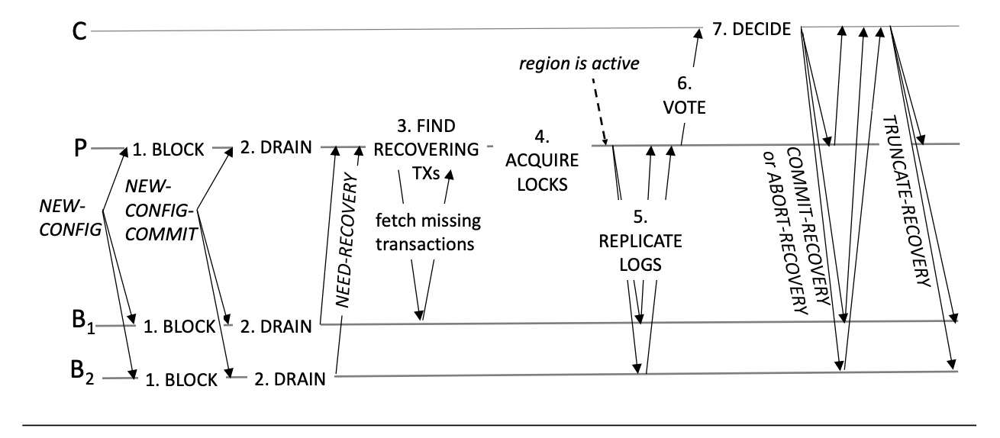

## Lecture-15: Optimistic Concurrency Control

### Introduction

FaRM, a main memory distributedbuted computing platform, provides distributed ACID transations with strict serializability, high availability, high throughput and low latency. These protocols were designed from first principles to leverage two hardware trends appearing in data centers: fast commodity networks with [RDMA](https://en.wikipedia.org/wiki/Remote_direct_memory_access) and an inexpensive approach to providing non-volatile DRAM. 

FaRM's protocols follow three principles to address these CPU bottlenecks: **reducing message counts, using one-sided RDMA reads and writes instead of messages, and exploiting parallelism effectively**

FaRM uses optimistic concurrency control with a four phase commit protocol (lock, validation, commit backup, and commit primaty).

One-sided RDMA uses no remote CPU and it avoids most local CPU overhead.

Using one-sided RDMA requires new failure-recovery protocol. FaRM cannot rely on servers to reject incoming requests when their leases expire. We solve this problem by using **precise membership** to ensure that machines agree on the current ocnfiguration membership and send one-sided operations only to machines that are members. Alse, FaRM uses **reservations** to ensure there is space in the logs for all the records needed to commit and truncate a transaction before starting the commit.

### Hardware trends

FaRM exploits two hardware trends to eliminate storage and network bottlenecks: non-volatile DRAM, and fast commodity networks with RDMA.

#### Non-volatile DRAM

A "distributed uninterruptible power supply (UPS)" exploits the wide availability of **Lithium-ion batteries** to lower the cost of a data center UPS over a traditional, centralized approach that uses lead-acid batteries.

A distributed UPS effectively makes DRAM durable. When a power failure occurs, the distributed UPS saves the contents of memory to a commodity SSD using the energy from battety.

On failure, when HDDs and NIC and saves in-memory data to SSD, additional SSDs reduce the time to save data and therefore the energy.

#### RDMA networking

FaRM uses one-sided RDMA operations and they do not use the remote CPU.

When the machine number in a cluster grows, we can eleminates the NIC message rate bottleneck. Both RDMA and RPC are now CPU bound and the performance gap reach to 4x (RDMA compare to RPC). 

### Programming model and architecture

An application thread can start a transaction at any time and it becomes the transaction's coordinator. During a transaction's execution, the thread can execute arbitraty logic as well as read, write, allocate, and free objects. At the end of the execution, the thread invokes FaRM to commit the transaction.

FaRM transactions use **optimistic concurrency control**. Updates are buffered locally during execution and only made visible to other transactions on a successful commit. FaRM provides **strict serializability** of all successful committed transactions.

The FaRM API alos procides lock-free reads, which are potimized single-object read only transactions.

A FaRM instance moves through a sequence of **configurations** over time as machine fails or new machines are added. A configuration is a tuple <i, S, F, CM> where **i** is a unique, monotonically increasing 64-bit configuration identifier, **S** is the set of machines in the configuration, **F** is a mapping from machines to failure domains that are expected to fail independently, and  **CM ∈ S** is the **configuration manager**. FaRM uses a Zookeeper coordination service to ensure machines agree on the current configuration and to store it. But it does not rely on Zookeeper to manage leases, detect failures, or coordinate recovery. Zookeeper is invoked by the CM once per configuration change to update the configuration.

The global address apce in FaRM consists of 2GB regions, each replicated on one primary and *f* backups, where *f* is the desired fauly tolerance. **Each machine stores several regions in non-volatile DRAM that can be read by other machines using RDMA.** Each object has a 64-bit version that is used for concurrency control and replication. The mapping of a region identifier to its primary and backups is maintained by the CM and replicated with the region.

Machines contact the CM to allocate a new region. The CM assigns a region identifier from a monotonically increasing counter and selects replicas for the region. And the region is colocated with a target region when the application specifies a locality constraint. It then sends a prepare message to the selected replicas with the region identifier. If all replicas report success in allocating the region, the CM sends a commit message to all of them.

Each machine also stores ring buffers that implement FIFP queues.

### Distributed transacions and replication

FaRM exploits one-sided RDMA reads and writes, primary-backup replication in non-volatile DRAM, and uses unreplicated transaction coordinators.

- During the execution phase, transactions use one-sided RDMA to read objects and they buffer writes locally.
- The coordinator records the addresses and versions of all objects accessed.
- For primaries and backups on the same machine as the coordinator, object reads and writes to the log use local memory accesses.
- At the end, FaRM attempts to commit the transaction:
  1. Lock. The coordinator writes a `LOCK` record to the log on rach machine that is a primary. This contain s the **versions, new values and the list of all regions with written objects**. Primaries process these records by attempting to lock the objects at the specified versions using compare-and-swap, and send back a message reporting whether all locks were successfully taken.
  2. Validate. The coordinator performs read validation by reading, from their primaries, the **versions** of all objects that were read but not written by the transaction. Validation uses one-sided RDMA reads by default. For primaries that hould more than t~r~ objects, validation is done over RPC.
  3. Commit backups. The coordinator writes a `COMMIT-BACKUP`  record to the non-volatile logs at each backup and then waits for an ack from the NIC hardware without interrupting the backup's CPU.
  4. Commit primaries. After all `COMMIT-BACKUP` writes have been acked, the coordinatoe writes a `COMMIT-PRIMARY` record to the logs at each primary. It reports completion to the application on receiving at least one hardware ack for such a record. Primaries process these records by updating the objects in place, which exposes the writes committed by the transaction.
  5. Truncate. Backups and primaries keep the records in their logs until they are truncated. The coordinator truncates logs at primaties and backups lazily after receiving acks from all primaries.

#### **Correctness**

 Committed read-write transactions are serializable at the point where all the writes locks were acquired, and committed read-only transactions at the point of their last read.

To ensure serializability across failures, it is necessary to wait for hardware acks from all backups before writing `COMMIT-PRIMARY`. 

Since the read set is stored only at the coordinator, it is necessary for the coordinator to wait for a successful commit at one of the primaries before reporting a successsful commit to the application.

In traditional two-phase commit protocols, participants can reserve resources to commit the transaction when they process the prepare message. However, FaRM avoids involving the backup's CPUs during the commit, the coordinator must **reserve log space at all participants** to guarantee progress. Including **truncate records** in primary and backup logs before starting the commit protocol. The reservation is released when the corresponding record is written. Truncation record reservations are also released if the truncation is piggybacked on another message.

#### **Performance**

Two-phase commit protocol with replication such as Spanner's, require `2f+1` replicas to tolerate `f` failures and.

FaRM uses primary-backup replication instead of Paxos state machine replication. This reduces the number of copies of data to `f + 1`, and also reduce the number of messages transmitted during a transaction. Coordinators state is not replicated and coordinators communicate directly with primaries and backups, futher reducing latency and message counts.

### Failure recovery

Failure recovery in FaRM has five phases described below: failure detection, reconfiguration, transaction state recovery, bulk data recovery, and allocator state recovery.

#### Failure detection

FaRM uses **lease**s to detect failures. Every machine holds a lease at the CM and the CM holds a lease at every other machine. Leases are granted using a 3-way handshake. Each machine sends a lease request to the CM and it responds with a message that acts as both a lease grant to the machine and a lease request from the CM. Then, the machien replies with a lease grant to the CM.

FaRM uses **dedicated queue pairs** for leases to avoid having lease messages delayed in a shared queue behind other message types. Lease renewal is attempted every 1/5 of the lease expire period to account for potential message loss.

Lease renewal must also be scheduled on the CPU in a timely way.

In addition, we do not assign FaRM threads to two hardware threads on each machine, leaving them for the lease manager. Our measurements show that the lease manager usually runs these hardware threads without impacting other FaRM threads.

Finally, we **preallocate all memory** used by the lease manager during initialization and we page in pin all the code it uses to avoid delays due to memory management.

#### Reconiguration

The reconfiguration protocol moves a FaRM instance from one configuration to the next. Since machines in the FaRM configuration read objects using RDMA reads without involving the remote CPU, the server's CPU cannot check if it holds the lease. Current NIC hardware does not support leases.

We solve this problem by implementing **precise membership**. After a failure, all machines in a new configuration must agree on its membership before allowing object mutations. Machines in the configuration do not issus RDMA requests to machines that are not in it, and replicas to RDMA reads and acks for RDMA writes from machines no longer in the configuration are ignored.

1. ***Suspect***. When a lease for a machine expires at the CM, it suspects that machine of failure and initiates reconfiguration. It starts **blocking** all external client requests. If a non-CM machine suspects the CM of failure due to a lease expiry, it first asks one of a small number of "backup CMs" to initiate reconfiguration. If the configution is unchanged after a timeout period then it attempts the reconfiguration itself. The machine initaiting the reconfiguration will try to become the new CM.
2. ***Probe***. The new CM issues an RDMA read to all machines in the configuration except the machine that is suspected. Any machine for which the read fails is also suspected. The new CM proceeds with the reconfiguration only if it obtains responses for a majority of the probes. 
3. ***Updata configuration***. After receiving replies to the probes, the new CM attempts to update the configuration data stored in. ZooKeeper ot <c+1, S, F, CM~id~>, where c is the current configuration identifier, S is the set of machines that replied to the probes, F is the mapping of machines to failure domains, and CM~id~ is its own identifier. We use Zookeeper znode sequence numbers to implement an atomic compare-and-swap that succeeds only if the current configuration is still c. This ensures that only one machine can sucessfully move the system to the configuration with identifier c+1 even if mult iple machines simultaneously attempt a configuration change.
4. ***Remap regions***. The new CM then reassigns regions previously mapped to failed machines to restore the number of replicas to f+1. For failed primaries, it always promotes a surviving backup to be the new primary to reduce the time to recover.
5. ***Send new configuration***. After remapping regions, the CM sends a `NEW-CONFIG` message to all the machines in the configuration with the configuration identifier, its own identifier, the identifiers of the other machines in the configuration, and all the new mapping regions to machines. It also resets the lease protocol if the CM has changed.
6. ***Apply new configuration***. When a machine receives a `NEW-CONFIG` with a configuration identifier that is greater than its own, it updates its current configuration identifier and its cached copy of the region mappings, and allocates space to hold any new region replicas assigned to it. It doesn't issue new requests to machines that are not in the configuration and it rejects read responses and write acks from those machines. It also starts blocking requests from external clients. Machines reply to the CM with `NEW-CONFIG-ACK` message.
7. ***Commit new configuration***. Once the CM receives `NEW-CONFIG-ACK` messages from all machines in the configuration, it waits to ensure that any leases granted in previous configurations to machines no longer in the configuration have expired. The CM then send a `NEW-CONFIG-COMMIT` to all the configuration members that also acts as a lease grant. All members new unblock previous blocked external client requests and initiate transaction recovery.

#### Transaction state recovery

FaRM recovers transaction state after a configuration change using the logs distributed across the replicas of objects modified by a transaction.

FaRM achieves fast recovery by distributing work across threads and machines in the cluster. Draining is done for all message logs in parallel. Step 1 and steps 3-5 are done for all regions in parallel. Steps 6-7 are done for all recovering transactions in parallel.

1. ***Block access to recovering regions***. When the primary of a region fails, one of the backups is promoted to be the new primary during reconfiguration. And block requests for local pointers and RDMA references to the region until step 4 when all write locks have been acquired for all recovering transactions that updated the region.

2. ***Drain logs***. All machines process all the records in their logs when they receives a `NEW-CONFIG-COMMIT` message. They record the configuration identifier in a. variable `LastDrained` when they are done. FaRM transaction have unique identifiers <c, m, t, l>. Log records for transactions with configuration identifiers less than or equal to `LastDrained` are rejected.

3. ***Find recovering transactions***. During log draining, the transaction identifier and list of updated region identifiers in each log record in each log is examined to determine the set of recovering transactions. 

   All machines must agree on whether a given transaction is a recovering transaction or not. We achieve this by piggy backing some extra metadata on the communication during the reconfiguration phase. The CM reads the `LastDrained` variable at each machine as part of the probe read. For each region `r` whose mapping has changed since `LastDrained`, the CM sends two configuration identifiers in the `NEW-CONFIG` message to that machine. These are `LastPrimaryChange[r], LastReplicaChange[r]`. 

   Records for a recovering transaction may be distribued over the logs of different primaries and backups updated by the transaction. Each backup of a region send a `NEED-RECOVERY` message to the primary with the configuration identifier, the region identifier, and the identifiers of recovering transactions that updated the region.

4. ***Lock recovery***. The primary of each region waits until the local machines log have been drained and `NEED-RECOVERY` messages have been received from each backup, to build the complete set of recovering transactions that affect the region. It then shards the transaction by identifier across its threads. In parallel, the threads in the primary fetch any transaction log records from backups that are not already stored locally and then lock any objects by recovering transactions.

   When lock recovery is complete for a region, the region is *active* and local and remote coordinators can obtain local pointers and RDMA references, which allows them to read objects and commit updates to this region in parallel with subsequent recovery steps.

5. ***Replicate log records***. The threads in the primary replicate log records by sending backups the `REPLICATE-TX-STATE` message for any transactions that they are missing. The message contains the region identifier, the current configuration identifier, and the same data as the `LOCK` record.

6. ***Vote***. The coordinator for a recovering transaction decides whether to commit or abort the transaction based on votes from each region updated by the transaction. These votes are sent by the primaries of each region. FaRM uses consistent hashing to determine the coordinator for a transaction.

   The threads in the primary send `RECOVERY-VOTE` message to their peer threads in the coordinator for each recovering transcation that modified the region. The vote is *commit-primary* if any replica saw `COMMIT-PRIMARY` or `COMMIT-RECOVERY`. Otherwise, it votes *commit-backup* if any replica saw `COMMIT-BACKUP` and did not see `ABORT-LOCK` record and no `ABORT-RECOVERY`. Otherwise, it votes *abort*. Vote message include the configuration identifier, the region identifier, the transaction identifier, and the list of region idenrifiers modified by the transaction.

   Primarties that do not habe any log records for the transaction vote *truncated* if thetransaction has already been truncated and *unknown* if it has not. Each thread maintains the set of identifiers of transactions whose records have been truncated from its logs. 

7. ***Decide***. The coordinator decides to commit a transaction if it receives a *commit-primary* vote from any region. Otherwise, it waits for all regions to vote and commits if at lease one region voted  *commit-backup* and all otehr regions modified by the transaction voted *lock*, *commit-backup*, or *truncated*. Otherwise it decides to abort. It then sends `COMMIT-RECOVERY` or `ABORT-RECOVERY` to all participants replicas. Both messages include the configuration identifier and the transaction identifier. `COMMIT-RECOVERY` is processed similarly to `COMMIT-PRIMARY` if received at a primary and to `COMMIT-BACKUP` if received at a backup. After the coordinator receives back acks from all primaries and backups, it sends a `TRUNCATE-RECOVERY` message.

#### Recovering data

FaRM must re-replicate data at new backups for a region to ensure that it can tolerate f replica failures in the future. Data recovery is not necessary to resume normal case operation, so we delay it until all regions become active to minimize impact on latency-critical lock recovery. Each machine sends a `REGIONS-ACTIVE` message to the CM when all regions for which it is primary become active. After receving all `REGIONS-ACTIVE` messages, the CM sends a message `ALL-REGIONS-ACTIVE` to all machines int the configuration. At this point, FaRM begins data recovery for new backups in parallel with foreground operations.

A new backup for a region initially has a freshly allocated and zeroe local region replica. It divides the region across worker threads that recover it in parallel. Recovery is paced by scheduling the next read to start at a random point within an interval after the start of the previous read.

Each recovered object must be examined before being copied to the backup. The object must has a version greater than the local version, then the backup locks the local version with a compare-and-swap, updates the object state, and unlocks it.

#### Recovering allocator state

The FaRM allocator splits regions into blocks that are used as slabs for allcating small objects. It keeps two pieces of **metadata**: block headers, which contain the object size, and slab free lists. Block headers are replcated to backups when a new block is allocated. Since block headers are used in data recovery, the new primary sends them to all backups immediately after receiving `NEW-CONFIG-COMMIT`.

The slab free lists are kept only at the primary to reduce the overheads of object allocation. Each object has a bit in its header that is set by an allocation and cleared by a free during transaction execution. This change to the object state is replicated during transaction commit as described in Section 4. After a failure, the free lists are recovered on the new primary by scanning the objects in the region, which is parallelized across all threads on the machine. 

