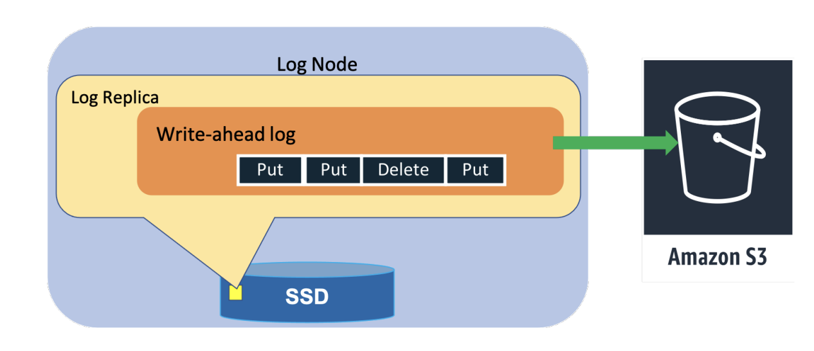

## Lecture-16: DynamoDB

[pdf](https://pdos.csail.mit.edu/6.824/notes/DynamoDB-MIT-Lecture-2023.pdf) : The figures in the pdf can help us better understand the operations.

Amazon DynamoDB is a NoSQL cloud database servise that provides consistent performance at any scale. 

Fundamental properties: consistent performance, availability, durability, and a fully managed serverless experience.

### Introduction

DynamoDB is a foudational AWS service that serves customers using a massive number of servers located in data centers around the world.

For DynamoDB customers, **consistent performance** at any scale is often more importnat than median request service times because unexpectedly high latency requests can amplify through higher layers of applications that depend on DynamoDB and lead to a bad customer experience.The goal of the design of DynamoDB is complete **all** requests with low single-digit millisecond latencies.

DynamoDB uniquely integrates the following six fundamental system properties:

- **DynamoDB is a fully managed cloud service.** DynamoDB handles resource provision, automatically recovers from failures, encrypt data, manages software upgrades, performs backups, and accomplishes other tasks required of a fully-managed service.
- **DynamoDB employs a multi-tenant architecture**. DynamoDB stores data from different customers on the same physical machines to ensure high utilization of resources.
- **DynamoDB achieves boundless scale for tables**. DynamoDB is designed to scale the resources dedicated to a table from several servers to many thousands as needed.
- **DynamoDB provides predictable performance**. Even as tables grow from a few megabytes to hundreds of terabytes, latencies remain stable due to the distributed nature of data placement and request routing algorithms in DynamoDB.  DynamoDB handles any level of traffic through horizontal scaling and automatically partitions and re-partitions data to meet an application's I/O performance requirements.
- **DynamoDB is highly available**. DynamoDB replicates data across multiple data centers--called Availablility Zones in AWS, and automatically re-replicates in the case of disk or node failures to meet stringent availablility and durability requirements. 
- **DynamoDB supports flexible use cases**. 

### Architecture

A DynamoDB table is a collections of items, and each item is a collection of attributes. Each item is uniquely identified by a primary key. The schema of the primary key is specfied at the table creation time. The primary key schema contains a partition key or a partition and sort key. The partition key’s value is always used as an input to an internal hash function. The output determines where the item will be stored. 

DynamoDB also supports secondary indexes to provide enhanced querying capability. 

A DynamoDB table is divided into multiple partitions to handle the throughput and storage requirements of the table. **Each partitions has multiple replicas** distirbuted across different Availability Zones for high availability and durability. The replicas for a partition form a replication group. The replication group uses Multi-Paxos for leader election and consensus.

Only the leader replica can serve write and strongly consistent read requests. Upon receiving a write request, the leader generates a write-ahead log record and sends it to its peer. A write is acknowledged to the application once a quorum of peers persists the log record to their local write-ahead logs. The leader of the group extends its leadership using a **lease mechanism**. If a leader is failure detected by any of its peers, the peer can propose a new round of the election to elect itself as the new leader. The new leader won't serve any writes or consistent reads until the previous leader's lease expires.

A replication group consists of storage replicas that contain both the write-ahead logs and the B-tree that stores the key-value data. 

To improve availability and durability, a replication group can also contain reolicas that only persist recent write-ahead log entries.

DynamoDB consists of tens of microservices. Some of the core services in DynamoDB are the **metadata service, the request routing service, the storage nodes, and the autoadmin service**. The metadata service stores routing information about the tables, indexes, and replication groups for keys for a given table or index. 

The request routing service is responsible for authorizing, authenticating, and routing each request to the appropriate server. All **read and update** requests are routed to the **storage nodes**. All **resource creation, update, and datadefinition** requests are routed to the **autoadmin service**. Each of the storage nodes hosts many replicas of different partitions.

The autoadmin service is built to be the central nervous system of DynamoDB. It is responsible for fleet health, partition health, scaling of tables, and execution of all control plane requests. The service continuously monitors the health of all the partitions and replaces any replicas deemed unhealthy. 

### Journey from provisioned to on-demand

In the original DynamoDB release, customers explicitly specified the throughput that a table required in terms of read capacity units(**RCUs**) and write capacity units(**WCUs**). For item up to 4KB in size, one RCU can perform one strongly consistent read request per second. For item up to 1KB in size, one WCU can perform one standard write request per second. **RCUs and WCUs** collectively are called **provisioned throughput**. The original system split a table into partitions that allow its contents to be spread across multiple storage nodes and mapped to both the available space and performance on those nodes.

DynamoDB uses admission control to ensure that storage nodes don't become overloaded, to avoid interference between co-resident table partitions, and to enforce the throughput limits requested by customers. **Admission control** was the shared responsibility **of all storage nodes for a table**. Srotage nodes indepently performed admission control based on the allocations of their locally stored partitions. Given that a storage node hosts partitions from multiple tables, the allocated throughput od each partition was used to isolate the workloads. 

When a partition was split for throughput, the new partitions were allocated throughput based on the table's provisioned throughput. For example, assume that a partition can accommodate a maximum provisioned throughput of 1000 WCUs. When a table is created with 3200 WCUs, DynamoDB created four partictions that each would be allocated 800 WCUs. If the table's provisioned thoughput was increased to 3600 WCUs, then each partition's capacity would increased to 900 WCUs. If the table's provisioned throughput was increased to 6000 WCUs, then partitions would be split to create eight child partitions, and each partitions would be allocated 750 WCUs. If the table's capacity was decreased to 5000 WCUs, then each partition's capacity would be decreased to 675 WCUs.

The uniform distribution of throughput across partitions is based on the assumptions that an application uniformly accesses keys in a table and the splitting a partition for size equally splits the performance. But application workloads frequently have non-uniform access partterns both over time and over key ranges. When the request rate within a table is non-uniform, splitting a partition and dividing performance allocation proportionately can result in the *hot* portion of the partition having less available performance than it did before the split. Since throughput was allocated statically and enforced at a partition level, these non-uniform workloads occasionally resulted in an application's reads and writes being rejected, called **throttling**.

**Two most commonly faced challenges by the applications**:

- **hot partitions**: Arose in applications that had traffic going consistently towards a few items if their tables.
- **throughput dilution**: Splitting a partition for size would cause the throughput of the partitions to be divided equally among the newly created child partitions, and hence the per partition throughput would decrease.

#### Initial improvements to adimission control

We liked that enforcing allocations at an individual partition level avoided the need for the complexities of distributed admission control, but it became clear these controls weren't sufficient. DynamoDB introduced two improvements, bursting and adaptive capacity, to address these concerns.

##### Bursting

The key observation that partitions had non-uniform access also led us to oberse that not all partitions hosted by a storage node used their allocated throughput simultaneously. So DynamoDB introduced the concept of bursting. The idea behind bursting was to let applications tap into the unused capacity at a partition level on a best effort basis to absorb short-lived spikes. DynamoDB retained a portion of a partition's unused capacity for later bursts of throughput usage for up to 300 seconds and utilized it when consumed capacity exceeded the provisioned capacity of the partition. The unused capacity is called burst capacity.

DynamoDB maintained workload isolation by ensuring that a partition could only burst if there was unused throughput at the node level. The capacity was managed on storage node using multiple token buckets: two for each partition (allocated and burst) and one for the node.

##### Adaptive capacity

DynamoDB launched adaptive capacity to better absorb long-lived spikes that cannot be absorbed by the burst capacity. Adaptive capacity actively monitored the provisioned and consumed capacity of all the tables. If a table experienced throttling and the table level throughput was not exceeded, then it would automatically increase the allocated throughput of the partions of the table using a proportinoal control algorithm. If the table was consuming more than its provisioned capacity then capacity of the partitions which received the boost would be decreased. The autoadmin system ensured that partitions receiving boost were relocated to an appropriate node that had the capacity to serve the increased throughput however like bursting, adaptive capacity was also best-effort but eliminated over 99.99% of the throttling due to skewed access pattern.

#### Global admission control

The shortcoming of bursting and adaptive capacity meant that the application using the table had already experienced brief period of unavailability.

Admission control was distributed and performed at a partition level. DynamoDB realized it would going to be beneficial to remove admission control from the partition and let the partition burst always while providing workload isolation.

To solve the problem of admission control, DynamoDB replaced adaptive capacity with global admission control(GAC). GAC builds on the same idea of token buckets. The GAC service centrally tracks the total consumption of the table capacity in terms of tokens. Each request router maintains a local token bucket to make admission decisions and communicates with GAC to replenish tokens at regular intervals. 

When a request from the application arrives, the request router deducts tokens. Eventually, the request router will run out of tokens because of consumption or expiry. When the request router runs of tokens, it requests more tokens from GAC. The GAC instance uses the information provided by the client to estimate the global token consumption and vends token available for the next time unit to the client's share of overall tokens. 

#### Balancing consumed capacity

DynamoDB implemented a system to proactively balance the partitions allocated acorss the storage nodes based on throughput consumption and storage to mitigate availability risks caused by tightly packed replicas. Each stroage node independently monitors the overall throughput and data size of all its hosted replicas. In case the throughput is beyond a threshold percentage of the maximum capacity of the node, it reports to the autoadmin service a list of candidate partition replicas to move from the current node. The autoadmin finds a new storage node for the partition in the same or another Availability Zone that doesn't have a replica of this partition.

#### Splitting for consumption

Even with GAC and the ability for partitions to burst always, tables could experience throttling if their traffic was skewed to a specific set of items. To address this probelm, DynamoDB automatically scales out partitions based on the throughput consumed. Once the consumed throughput of a partition crosses a certain threshold, the partition is split for consumption.

#### On-demand provisioning

DynamoDB provides a simplified serverless operatioal model and a new model ofr provisioning - **read and write capacity units**. To improve the customer experience for spiky workloads, we launched **on-demand tables**. On-demand tables remove the burden from out customers of figuring out the right provisioning for tables. DynamoDB provisions the on-demand tables based on the consumed capacity by collecting the signal of reads and writes and instantly accommodates up to double the previous peak traffic on the table.

### Durability and correctness

#### Hardware failures

As with most database management systems, the write-ahead logs in DynamoDB are central for providing durability and crash recovery. Write ahead logs are stored in all three replicas of a partition. For higher durability, the write ahead logs are periodically archived to S3. Each replica still contains the most recent write-ahead logs that are usually waiting to be archived.

When a node fails, all replication groups hosted on the node are down to two copies. The process of healing a storage replica can take several minutes because the repair process involves copying the B-tree and write-ahead logs. 

#### Silent data errors

Some hardware failures can cause incorrect data to be stored. DynamoDB makes extensive use of checksums to detect silent errors. Bymaintaining checksums within every log entry, messafe and log file, DynamoDB validates data integrity for every data transfer between two nodes.

Every log file that is archived to S3 has a manifest that contains information about the log, such as a table, partition and start and end markers for the data stored in the log file. The agent responsible for archiving log files to S3 performs various checks before uploading the data. Once all the checks are passed, the log file and its manifest are archived. Log archival agents run on all three replicas of replication group. If one of the agents finds that a log file is already archived, the agent downloads the uploaded file to verify the intergrity of the data by comparing it with its local write-ahead log. Every log file and manifest file are uploaded to S3 with a content checksum. The content checksum is checked by S3 as part of the put operation, which guards against any errors during data transit to S3.

#### Continuous verification

DynamoDB also continuously verfies data at rest. An example of such a continuous verification systems is the *scrub* process. The goal of scrub is to detect errors that we had not anticipated, such as bit rot. The scrub process runs and verifies two things: all three copies of the replicas in a replication group have the same data, and data of the live replicas matches with a copy of a replica built offline using the archived write-ahead log entries. The verification is done by computing the checksum of the live replcia and mathing that with a snapshot of one generated from the log entires archived in S3. 

#### Software bugs

The core replication protocol was specified using TLA+. When new features that affect the replication protocol are added, they are incorporated into the specification and model checked. Model checking has allowed us to catch subtle bugs that could have led to durability and correctness issues before the code went into production.
We also employ extensive failure injection testing and stress testing to ensure the correctness of every pieces of software deployed.

#### Backups and restores

Backups or restores don't affect performance or availability of the table as they are built using the write-ahead logs that are archived in S3. The backups are full copies of DynamoDB tables and are stored in an Amazon S3 bucket. Data from a backup can be restored to a new DynamoDB table at any time.

DynamoDB also supports point-in-time restore. Customers can restore the contents of a table that existed at any time in the previous 35 days to a different DynamoDB table in the same region. DynamoDB creates periodic snapshots of the partitions that belong to the table and uploads them to S3. The periodicity at which a partition is snapshotted is decided based on the amount of write-ahead logs accumulated for the partition. When a point-in-time restore is requested for a table, DynamoDB identifies the closest snapshots to the requested time for all the partitions of the tables, applies the logs up to the timestamp in the restore request, creates a snapshot of the table, and restores it.

### Availability

To achieve high availability, DynamoDB tables are distributed and replicated across multiple Availability Zones(AZ) in a Region. DynamoDB regularly tests resilience to node, rack, and AZ failures. 

#### Write and consistent read availability

A partition's write availability depends on its ability to have a healthy leader and a healthy write quorum. A healthy write quorum in the case of DynamoDB consists of **two out of the three replicas** from different AZs. A partition remains available as long as there are enough healthy replicas for a write quorum and a leader. If one of the replicas is unresponsive, the leader adds a log replica to the group. **Adding a log replica** is the fastest way to ensure that the write quorum of the group is always met. The leader replica servers consistent reads.

#### Failure detection

A newly elected leader will have to wait for the expire of the old leader's lease before serving any traffic.

To solve availability problem caused by gray failures, a follower that wants to trigger a failover sends a message to other replicas in the replication group asking if they can communicate with the leader. If replicas respond with a healthy leader message, the follower drops the attempt to trigger a leader election. 

#### Measuring availability

Availability is calcucated for each 5-minute interval as the percentage of requests processed by DynamoDB that succeed. DynamoDB continuously monitors availability at **service and  table levels**. The tracked avaiability data is used to analyze customer preceived availability trends and trigger alarms if customers see errors above a certian threshold. These alarms are called customer facing alarm(**CFA**). The goal of these alarms is to report any availability-related problems and proactively mitigate the problem either automatically or through operator intervention.

DynamoDB also measures and alarms on availability observed on the client-side. There are two sets of clients used to measure the user-perceived availability. The first set of clients are internal Amazon services using DynamoDB as the data store. These services share the availability metrics for DynamoDB API calls as observed by their software. The second set of clients is our DynamoDB canary applications. These applications are run from every AZ in the Region, and they talk to DynamoDB through every public endpoint.

#### Deployments

Often deployments invovle updating numerous services. DynamoDB pushes software updates at a regular cadence. The new software being deployed goes through a full development and test cycle to build confidence in the correctness of the code. 

There could be times when the newly deployed software doesn't work and needs a rollback. The rolled-back state might be different from the initial state of the software. The rollback procedure is often missed in testing and can lead to customer impact. DynamoDB runs a suite of upgrade and downgrade tests at a component level before every deployment. Then, the software is rolled back on purpose and tested by running functional tests.

Deploying software on a single node is quite different from deploying software to multiple nodes. The deployments are not atomic in a distributed system, and, at any given time, there will be software running the old code on same nodes and new code on other parts of the fleet. The additional challenge with distributed deployments is that the new software might introduce a new type of message or change the protocol in a way that old software in the system doesn’t understand. DynamoDB handles these kinds of changes with read-write deployments. Read-write deployment is completed as a multistep process. The first step is to deploy the software to read the new message format or protocol. Once all the nodes can handle the new message, the software is updated to send new messages. New messages are enabled with software deployment as well.

All the deployments are done on a small set of nodes before pushing them to the entire fleet of nodes. The strategy reduces the potential impact of faulty deployments. DynamoDB sets alarm thresholds on availability metrics.

#### Dependencies on external services

DynamoDB uses IAM and AWS KMS to authenticate every customer request. While these services are highly available, DynamoDB is designed to operate when these services are unavailable without sacrificing any of the security properties that these systems provide.

In the case of IAM and AWS KMS, DynamoDB employs a statically stable design, where the overall system keeps working even when a dependency becomes impaired. DynamoDB caches result from IAM and AWS KMS in the request routers that perform the authentication of every request. DynamoDB periodically refreshes the cached results asynchronously.

#### Metadata availability

The metadata between a table's primary keys and storage nodes is stored in DynamoDB itself. This routing information consisted of all the partitions for a table, the key range of each partition, and the storage nodes hosting the partition.

DynamoDB build an in-memory distributed datastore called MemDS. it stores all the metadata in memory and replicates it across the MemDS fleet. MemDB scales horizontally to handle the entire incoming request rate of DynamoDB.

The MemDS Perkle tree additionally supports two special lookup operations: floor and ceiling. The floor operation accepts a key and returns a stored entry whose key is less than or equal to the given key. While the ceiling operation returns which greater.

