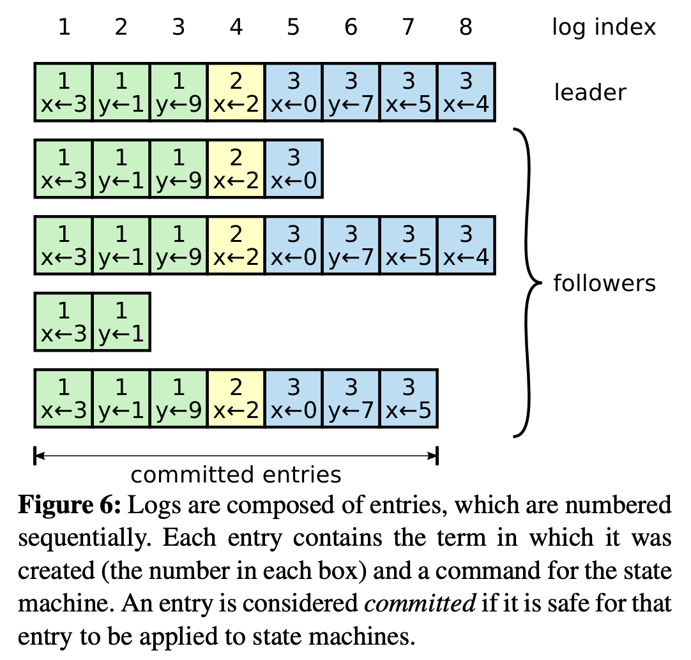
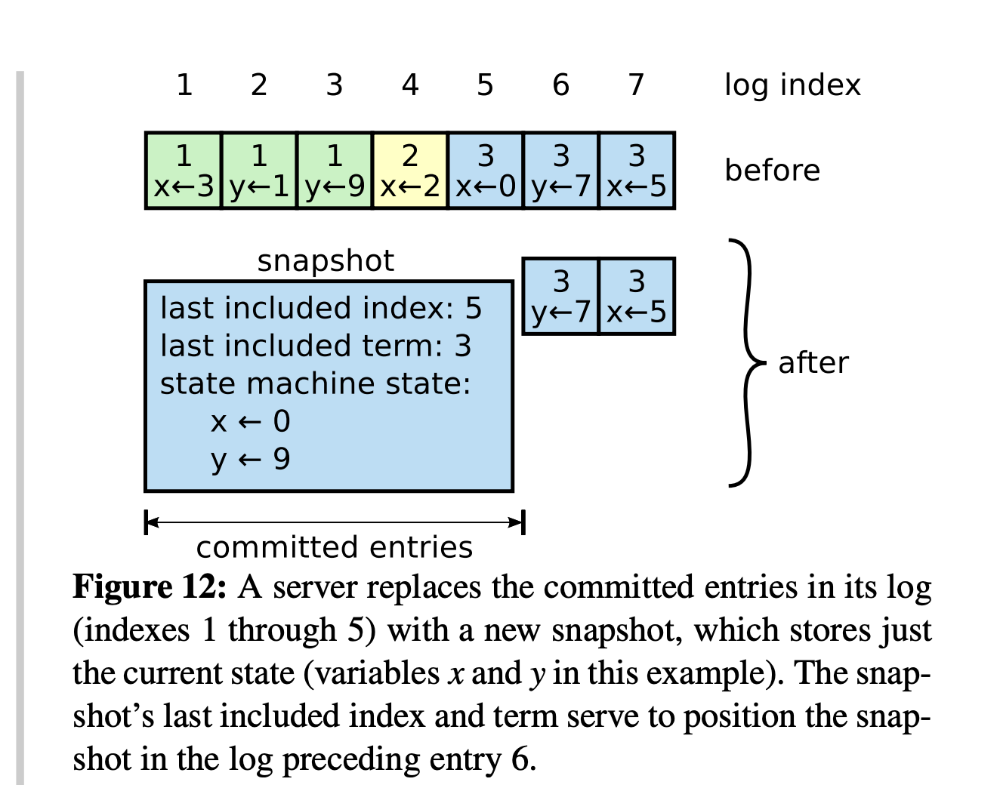
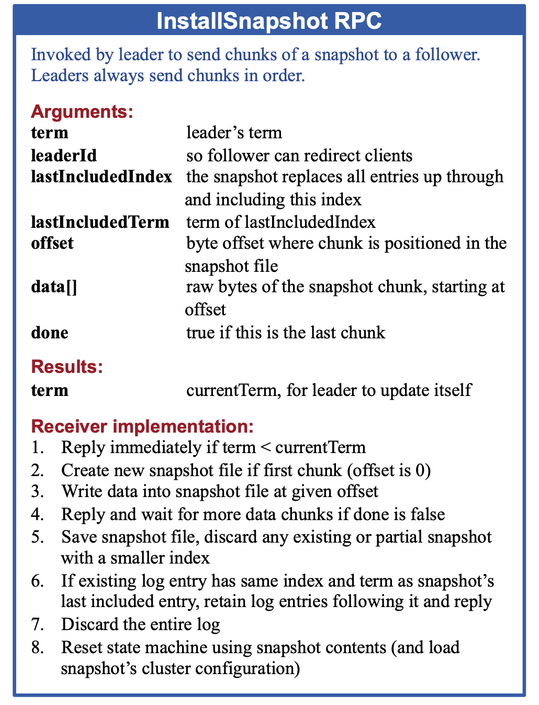

## Lecture-5: Raft

[paper](https://pdos.csail.mit.edu/6.824/papers/raft-extended.pdf)

### Overview

Raft is a consensus algorithm for managing replicated log. It produces a result equivalent to Paxos, and it is as efficient as Paxos, but its structure is different from Paxos and makes Raft more understandable.

Several novel features:

- Strong leader
- Leader election: **Randomized** timers to elect leaders.
- Membership changes: use a new *joint consensus* approach where the majorities of two different configurations overlap during transitions.

Shortcoming of Paxos

- Difficult to understand
- Doesn't provide a good foundation for building practical implementation.
- The Paxos architecture is a poor one for building practical systems.
- Paxos uses a symmetric peer-to-peer approach at its core. (This make sense in a simplified world where only one decision will be made, but slower in making a series of decisions).

Given the leader approach, Raft decomposes the consensus problem into **three relatively independent subproblems**:

- **Leader election**
- **Log replication**
- **Safety**

### Replicated state machines

Consensus algorithms typically arise in the context of *replicated state machine*s. It makes a collection of servers compute even if some of the servers are down (Fault tolerance).

Replicated state machines are typically implemented using a replicated log. Each servers **stores a log** containing a series of commands, which its state machine executes in order. Since the state machine are **deterministic**, each computes the same state and the same sequence of outputs.

**Keeping log consistent**: The consensus module on a server receives commands from clients and adds them to its log. **It communicates with the consensus module on other servers** to ensure that every log eventually contains the same request in the same order, even if some servers fail. Once commands are properly replicated, each server's state machine processes them in log order.

Consensus algorithms for practical systems have the following properties:

- Ensure **safety** under non-Byzantine conditions.
- They are fully functional (available) as long as any majority of the servers are operational and can communicate with each other and with clients.
- They do not depend on timing to ensure the consistency of the logs.
- A command can complete as soon as a majority of the cluster has responded to a single round of remote procedure calls; a minority of slow servers need not impact overall system performance.

### The Raft consensus algorithm

#### Raft basics

A Raft cluster conntains several servers; fives is a typical number, which allows the system to tolerate two failures (half of the servers are active).]. At any time each server is in one of **three states**: *leader*, *follower*, or *candidate*. 

- In normal operation there is exactly one leader and all of the other servers are followers. The third state **candidate** is used to elect a new leader.
- If a follower receives no communication, it becomes a candidate and initiates an election. A candidate that receives votes from a majority of the full cluster becomes the new leader.

- Each term begin with a *election*. If a candidate wins the election, then it serves as leader for the rest of the term.
- Each **server stores a *current term* number**, which increases monotonically over time. Current terms are **exchanged whenever servers communicate**; if one server's current term is smaller than the other's, then it updates its current term to the larger value. If a candidate or leader discovers that its term is **out of date**, it immediately **reverts to follower state**. If a server receivers a request with a **stale term number**, it **rejects** the request.

#### Leader election (Lab 2A)

Raft uses a heartbeat mechanism to trigger leader election. When servers start up, they **begin as followers**. A server remains in follower state as long as it receives valid RPCs from a leader or candidate. Leaders send periodic heartbeadts to all followers in order to maintain their authority. If a follower receives no communication over a period of time called the *election timeout*, then it assumes there is no visable leader and **begins an election to choose a new leader**.

Election:

- To begin an election, a follower increments its current term and transitions to candidate state. It votes for itself and issues RequestVote RPCs. A candidate continues the state until one of three things happens:

  - It wins the election:

    A candidate wins an election if it receives votes from a majority of the servers in the full cluster for the same term. Each server will vote for **at most one** candidate in a given term, on a FIFO basis. The majority rule ensures that at most one candidate can win the election for a particular term. Once a candidate wins an election, it becomes the leader, sends heartbeat messages to all of the other servers to establish its authority and prevent new election.

  - Another server establishes itself as leader
  - a period of time goes by with no winner.

#### Log replication (Lab 2B)

Each client request contains a command to be executed by the replicated state machines. The leader **appends the command to its log** as a new entry, then **issues AppendEntries RPCs** in parallel to each of the other servers to replicate the entry . When the entry has been safely replicated, the leader applies the entry to its state machine and returns the result of the execution to the client. If anything wrong happen, the leader retries AppendEntries RPCs infinitely util all followers eventually store all log entries.

- In Raft the leader handles inconsistencies by forcing the followes's llogs to duplicate its own. **Conflicting entries in follower logs will be overwritten with entries from leader's log**.
  - The leader must fine the latest log entry where the two logs agree. The leader maintains a *nextIndex* for each follower, which is the index of the next log entry the leader will send to that follower.
  - When a leader first come to power, it initializes all nextIndex values to the `lastLogIndex + 1`. 
  - If a follower's log is inconsistent with the leader's, the AppendEntires consistency check will fail in the next AppendEntries RPC. After a rejection, the leader **decrement *nextIndex*** and retries the AppendEentries RPC.
  - *If desired, the protocol can be optimized to reduce the number of rejected AppendEntries RPCs. When rejecting, the follower can include the term of the conflicting entry and the first index it stores for that term. But in practice, it seems not necessary.

##### Safety

- Election restriction

  In any leader-based consensus algorithm, the leader must eventually store all of the committed log entries. 

  Raft **uses the voting process** to prevent a candidate from winning an election unless its log contains all committed entries. A candidate must contact with a majority of the cluster in order to be elected, which means that every committed entry must be present in at least one of those servers. If the candidate's log is at least as **up-tp-date** as any other log in that majority, then it will hold all the committed entries. The `RequestVote` RPC implements this restriction: the RPC includes information about the candidate's log, and the voter denies its vote if its won log is more up-to0date than that of the candidate.

  Raft detemines which of two logs is more up-to-date by comparing the index and term of the last entries in the logs. First compare the term, if equal, compare the length of log.

- Committing entries from previous terms

  Raft never commits log entries from previous terms by counting replicas. Only log entries from the leader's current term are committed by counting replicas; once an entry from the current term has been committed in this way, then all prior entries are committed indirectly because of the Log Matching Property.

- Time

  MTBF is the average time between failures for a single server
  $$
  broadcastTime << electionTimeout << MTBF
  $$

#### *Cluster membership changes

In practice, configuration will occasionally be necessary to change the configuration. Eg. When the cluster grows from three servers to five. There is a point in time where two different leaders can be elected for the same term, one with a majority of the old configuration, and another with a majority of the new configuration.

In order to ensure safety, configuration changes must use a two-phase approach.

In Raft the cluster first switches to a transitional configuration we called **joint consensus**, once the joint consensus has been committed, the system then transitions to the new configuration. The system then transitions to the new configuration.

Joint consensus

- Log entries are replicated to all servers in both configurations.
- Any server from either configuration may serve as leader.
- Agreement requires separate majorities from both the old and new configurations.

There are three more issues to address for reconfiguration. 

- The first issue is that new servers may not initially store any log entires. If. they are added to the cluster in this state, it could take a while for them to catch up. In order to avoid avaliability gaps, Raft introduces an additional phase before configuration changes, in which the new servers join the cluster as **non-voting members**, once the new servers have caught up with the rest of the cluster, the reconfiguration can proceed.
- The second issue is that the cluster leader may not be part of the new configuration. This means that there will be a period of time when the leader is managing a cluster that does not include itself; it replicates log entries but does not count itself in majorities. In this case, the leader steps down to follower state once it has commmitted new configuration log entry.
- The third issue is that removed servers can disrupt the cluster. These servers will not receive heartbeats, so they will time out and start new elections. They will then send RequestVote RPCs with new term numbers, and this will cause the current leader to revert to follower state. To prevent this problem, servers **disregard RequestVote PRCs when they believe a current leader** exists. Specifically, if a sever receives a RequestVote RPC within the minimum election timeout of hearing from a current leader, it does not update its term or grant its vote. This does not affect normal elections. However, it helps avoid disruptions from removed servers.

#### Log compaction (Lab 2D)

In practical syste, log cannot grow without bound. As the log grows longer, it occupies more space and takes more time to reply. This will eventually cause availability problems without some emechanism to discard obsolete information that has accumulated in the log.

Snapshotting is the simplest approach to compaction. In snapshotting, the entire current system state is written to a *snapshot* on stable storage, **then the entire log up to that point is discarded**.

Each server takes snapshots independently, covering just the committed entires in its log. Most of the work consists of the state machine writing its current state to the snapshot. Raft also includes a small amount of metadata in the snapshot: the **last inluded index** is the index of the last entry in the log that the snapshot replaces(the last entry the state machine had applied), and the **last included term** is the term of this entry. These are preserved to support the AppendEntries consistency check for the first log entry following the snapshot, since that entry needs a previous log index and term. To enable cluster membership changes, the snapshot also includes the latest configuration in the log as of last included index. Once a server completes writing a snapshot, it may delete all log entries up through the last included index, as well as any prior snapshot.

The leader must **occasionally send snapshots to followers** that lag behind. This happends when the leader has already discarded the next log entry that it needs to send to a follower. 

The leader uses a new RPC called **InstallSnapshot** to send snapshots to followers that are too far behind. When a follower receives a snapshot with this RPC, it must decide what to do with its existing log entries. Usually the snapshot will contain new information not already in the recipient's log. In this case, the follower **discards its entire log**. It is all superseded by the snapshot and may possibly have uncommitted entries that conflict with the snapshot. If instead the follower receives a snapshot that describes a prefix of its log, then **log entries coverd by the snapshot are deleted** but entries following thesnapshot are still valid and must be retained.

Servers must decide when to snapshot. One simply strategy is to t**ake a snapshot when the log reaches a fixed size in bytes**. If this size is set to be significantly larger than the expected size of a snapshot, then the disk bandwidth overhead for snapshotting will be small.

Writing a snapshot can take a significant amoun of time, and we do not want this to delay normal operations. The solution is to use **copy-on-write** techniques so that new updates can be accepted without impacting the snapshot being written.

#### Client interaction

Introduce how clients find the cluster leader and how Raft support linearizable semantics.

Clients of Raft send all of their requests to the leader. When a client first starts up, it connects to a randomly chosen server. If the client;s first choicec is not the leader, that server will reject the client's request and supply information about the most recent leader it has heard from.

If a leader crashes after committing the log entry but before responding to the client, the client will retry the command with a new leader, causing it to be executed a second time. The solution is for clients to assign unique serial numbers to every command. Then, the state machine tracks the latest sociated response. If it receives a command whose serial number has already been executed, it responds immediately without re-executing the request.

**Read-only operations**: the leader respond to the operation might have been superseded by a newer leader. So that it will receive stale information.

- Each leader commit a blank no-op entry into the log at the start of its term.
- A leader must check whether it has been deposed before processing a read-only request. Raft handles this by having the leader exchange heartbeat messages with a majority of the cluster before responding to read-only requests.