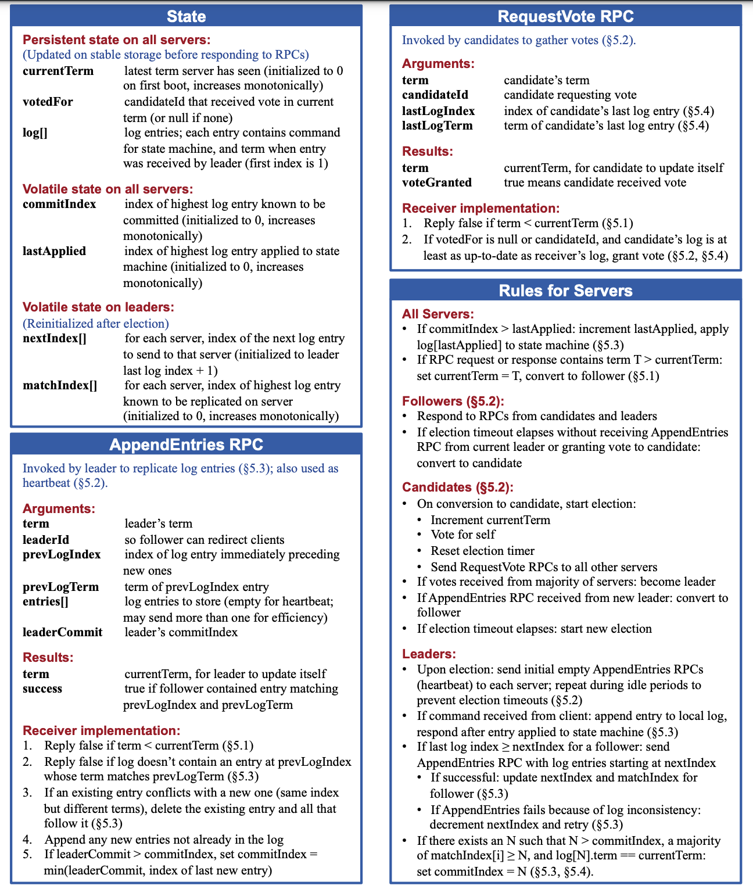
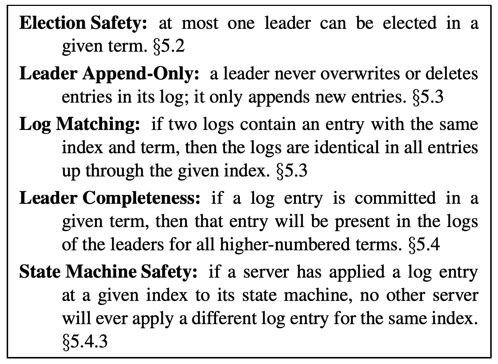
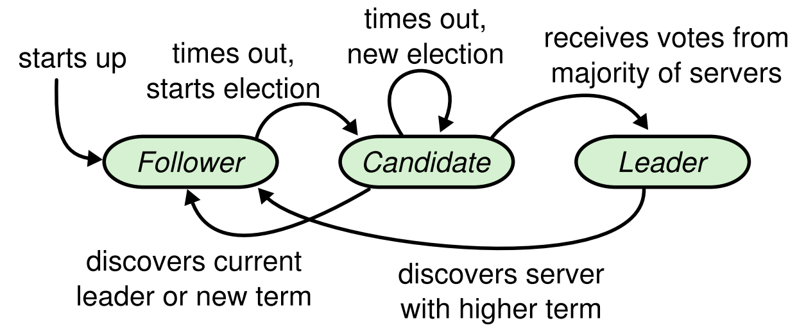
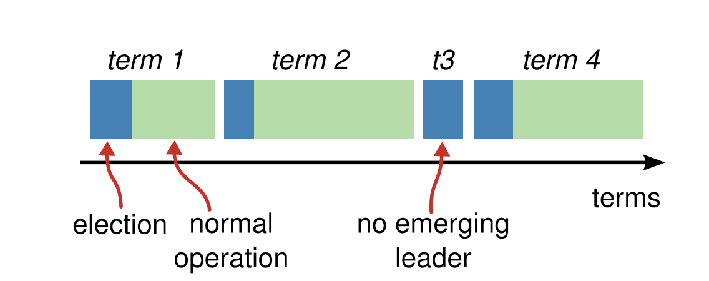

## Lecture-5: Raft

[paper](https://pdos.csail.mit.edu/6.824/papers/raft-extended.pdf)

### Overview

Raft is a consensus algorithm for managing replicated log. It produces a result equivalent to Paxos, and it is as efficient as Paxos, but its structure is different from Paxos and makes Raft more understandable.

Several novel features:

- Strong leader
- Leader election: **Randomized** timers to elect leaders.
- Membership changes: use a new *joint consensus* approach where the majorities of two different configurations overlap during transitions.

Shortcoming of Paxos

- Difficult to understand
- Doesn't provide a good foundation for building practical implementation.
- The Paxos architecture is a poor one for building practical systems.
- Paxos uses a symmetric peer-to-peer approach at its core. (This make sense in a simplified world where only one decision will be made, but slower in making a series of decisions).

Given the leader approach, Raft decomposes the consensus problem into **three relatively independent subproblems**:

- **Leader election**
- **Log replication**
- **Safety**

### Replicated state machines

Consensus algorithms typically arise in the context of *replicated state machine*s. It makes a collection of servers compute even if some of the servers are down (Fault tolerance).

Replicated state machines are typically implemented using a replicated log. Each servers **stores a log** containing a series of commands, which its state machine executes in order. Since the state machine are **deterministic**, each computes the same state and the same sequence of outputs.

**Keeping log consistent**: The consensus module on a server receives commands from clients and adds them to its log. **It communicates with the consensus module on other servers** to ensure that every log eventually contains the same request in the same order, even if some servers fail. Once commands are properly replicated, each server's state machine processes them in log order.

Consensus algorithms for practical systems have the following properties:

- Ensure **safety** under non-Byzantine conditions.
- They are fully functional (available) as long as any majority of the servers are operational and can communicate with each other and with clients.
- They do not depend on timing to ensure the consistency of the logs.
- A command can complete as soon as a majority of the cluster has responded to a single round of remote procedure calls; a minority of slow servers need not impact overall system performance.

### The Raft consensus algorithm

#### Raft basics

A Raft cluster conntains several servers; fives is a typical number, which allows the system to tolerate two failures (half of the servers are active).]. At any time each server is in one of **three states**: *leader*, *follower*, or *candidate*. 

- In normal operation there is exactly one leader and all of the other servers are followers. The third state **candidate** is used to elect a new leader.
- If a follower receives no communication, it becomes a candidate and initiates an election. A candidate that receives votes from a majority of the full cluster becomes the new leader.

- Each term begin with a *election*. If a candidate wins the election, then it serves as leader for the rest of the term.
- Each **server stores a *current term* number**, which increases monotonically over time. Current terms are **exchanged whenever servers communicate**; if one server's current term is smaller than the other's, then it updates its current term to the larger value. If a candidate or leader discovers that its term is **out of date**, it immediately **reverts to follower state**. If a server receivers a request with a **stale term number**, it **rejects** the request.

#### Leader election

Raft uses a heartbeat mechanism to trigger leader election. When servers start up, they **begin as followers**. A server remains in follower state as long as it receives valid RPCs from a leader or candidate. Leaders send periodic heartbeadts to all followers in order to maintain their authority. If a follower receives no communication over a period of time called the *election timeout*, then it assumes there is no visable leader and **begins an election to choose a new leader**.

Election:

- To begin an election, a follower increments its current term and transitions to candidate state. It votes for itself and issues RequestVote RPCs. A candidate continues the state until one of three things happens:

  - It wins the election:

    A candidate wins an election if it receives votes from a majority of the servers in the full cluster for the same term. Each server will vote for **at most one** candidate in a given term, on a FIFO basis. The majority rule ensures that at most one candidate can win the election for a particular term. Once a candidate wins an election, it becomes the leader, sends heartbeat messages to all of the other servers to establish its authority and prevent new election.

  - Another server establishes itself as leader
  - a period of time goes by with no winner.

#### Log replication

Each client request contains a command to be executed by the replicated state machines. The leader **appends the command to its log** as a new entry, then **issues AppendEntries RPCs** in parallel to each of the other servers to replicate the entry . When the entry has been safely replicated, the leader applies the entry to its state machine and returns the result of the execution to the client. If anything wrong happen, the leader retries AppendEntries RPCs infinitely util all followers eventually store all log entries.

- In Raft the leader handles inconsistencies by forcing the followes's llogs to duplicate its own. **Conflicting entries in follower logs will be overwritten with entries from leader's log**.
  - The leader must fine the latest log entry where the two logs agree. The leader maintains a *nextIndex* for each follower, which is the index of the next log entry the leader will send to that follower.
  - When a leader first come to power, it initializes all nextIndex values to the `lastLogIndex + 1`. 
  - If a follower's log is inconsistent with the leader's, the AppendEntires consistency check will fail in the next AppendEntries RPC. After a rejection, the leader **decrement *nextIndex*** and retries the AppendEentries RPC.
  - *If desired, the protocol can be optimized to reduce the number of rejected AppendEntries RPCs. When rejecting, the follower can include the term of the conflicting entry and the first index it stores for that term. But in practice, it seems not necessary.

##### Safety

- Election restriction

  In any leader-based consensus algorithm, the leader must eventually store all of the committed log entries. 

  Raft **uses the voting process** to prevent a candidate from winning an election unless its log contains all committed entries. A candidate must contact with a majority of the cluster in order to be elected, which means that every committed entry must be present in at least one of those servers. If the candidate's log is at least as **up-tp-date** as any other log in that majority, then it will hold all the committed entries. The `RequestVote` RPC implements this restriction: the RPC includes information about the candidate's log, and the voter denies its vote if its won log is more up-to0date than that of the candidate.

  Raft detemines which of two logs is more up-to-date by comparing the index and term of the last entries in the logs. First compare the term, if equal, compare the length of log.

- Time
  $$
  broadcastTime << electionTimeout << MTBF
  $$